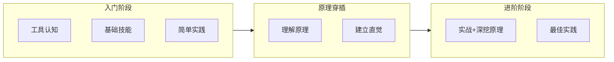
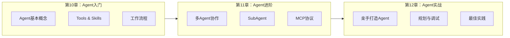

# 《AI编程入门指南》设计文档

> 本文档记录书籍的目录结构和设计思路，便于后续编写时参考。

## 一、目标定位

- **目标读者**：AI初学者、想用AI辅助编程的开发者
- **核心主题**：AI编码，从浅到深
- **内容风格**：注重实际应用，穿插介绍必要原理
- **不追求**：深入讨论所有技术原理，保持入门友好

---

## 二、完整目录结构

```
docs/
├── intro.md                    # 前言：AI时代，编程变得更简单
│
├── chapter-01/                 # 第一章：AI与编程的初次相遇
│   ├── why-ai-coding.md       # 为什么用AI辅助编程
│   ├── llm-overview.md        # 认识主流大模型
│   ├── ai-coding-tools.md     # 主流AI编码工具介绍
│   └── first-attempt.md       # 第一次让AI写代码
│
├── chapter-02/                 # 第二章：AI编码工具详解
│   ├── tools-comparison.md    # 工具对比与选择建议（引入）
│   ├── cursor-guide.md        # Cursor使用指南（IDE代表）
│   └── claude-code.md         # Claude Code入门（终端工具代表）
│
├── chapter-03/                 # 第三章：AI编程基础技能
│   ├── prompt-for-code.md     # 如何描述你的编程需求
│   ├── understand-code.md     # 让AI解释代码
│   ├── debug-with-ai.md       # AI辅助调试代码
│   └── code-review.md         # AI代码审查
│
├── chapter-04/                 # 第四章：从零开始——AI带你写程序
│   ├── hello-world.md         # 第一个程序
│   ├── simple-script.md       # 实用小脚本（文件处理等）
│   ├── web-scraper.md         # 网页数据抓取
│   └── mini-project.md        # 小项目实战
│
├── chapter-05/                 # 第五章：理解AI的"思考"——基础原理
│   ├── how-ai-learns.md       # AI是如何学习的（训练数据、模式识别）
│   ├── llm-basics.md          # 大语言模型基础概念
│   ├── context-window.md      # 上下文窗口是什么
│   └── token-explained.md     # Token：AI的"词汇单位"
│
├── chapter-06/                 # 第六章：AI辅助前端开发
│   ├── html-css-basics.md     # HTML/CSS快速上手
│   ├── javascript-intro.md    # JavaScript入门
│   ├── react-with-ai.md       # AI辅助React开发
│   └── responsive-design.md   # 响应式页面开发
│
├── chapter-07/                 # 第七章：AI辅助后端开发
│   ├── python-basics.md       # Python快速入门
│   ├── api-development.md     # API开发实战
│   ├── database-basics.md     # 数据库操作
│   └── deployment.md          # 部署你的应用
│
├── chapter-08/                 # 第八章：AI编程进阶技巧
│   ├── refactoring.md         # 代码重构
│   ├── testing.md             # AI辅助写测试
│   ├── documentation.md       # 自动生成文档
│   └── project-structure.md   # 项目架构设计
│
├── chapter-09/                 # 第九章：深入理解AI——进阶原理
│   ├── embedding.md           # 向量嵌入与语义理解
│   ├── rag-explained.md       # RAG：让AI有"记忆"
│   ├── prompt-engineering.md  # 提示词工程原理
│   └── model-capabilities.md  # 不同模型的能力差异
│
├── chapter-10/                 # 第十章：AI Agent——让AI自主工作
│   ├── what-is-agent.md       # 什么是AI Agent（代理）
│   ├── tools-intro.md         # Tools：AI的"双手"
│   ├── skills-explained.md    # Skills：AI的技能系统
│   └── agent-workflow.md      # Agent工作流程解析
│
├── chapter-11/                 # 第十一章：Agent进阶——多智能体协作
│   ├── subagent.md            # SubAgent：分工协作的子代理
│   ├── multi-agent.md         # 多Agent协作模式
│   ├── mcp-protocol.md        # MCP协议：Agent的通信标准
│   └── agent-patterns.md      # 常见Agent设计模式
│
├── chapter-12/                 # 第十二章：打造你的AI Agent
│   ├── plan-mode.md           # 规划模式：让AI制定方案
│   ├── custom-agent.md        # 创建自定义Agent
│   ├── agent-tools-dev.md     # 为Agent开发工具
│   └── agent-debug.md         # Agent调试与优化
│
├── chapter-13/                 # 第十三章：AI+开发实战项目
│   ├── project-intro.md       # 项目规划与设计
│   ├── project-frontend.md    # 前端开发
│   ├── project-backend.md     # 后端开发
│   ├── project-integrate.md   # AI功能集成
│   └── project-deploy.md      # 部署上线
│
├── chapter-14/                 # 第十四章：AI编程最佳实践
│   ├── effective-prompts.md   # 高效提示词模式
│   ├── iterative-coding.md    # 迭代式开发流程
│   ├── when-ai-fails.md       # AI的局限性与应对
│   └── security-notes.md      # 代码安全注意事项
│
└── appendix/                   # 附录
    ├── glossary.md            # 常用术语表
    ├── prompt-templates.md    # 编程提示词模板库
    ├── resource-links.md      # 学习资源推荐
    └── faq.md                 # 常见问题解答
```

---

## 三、整体学习路径



---

## 四、章节设计详解

### 第一部分：入门基础（第1-4章）

建立对AI编程的基本认知，掌握工具使用和基础技能。

| 章节 | 标题 | 核心目标 | 章节定位 |
|------|------|----------|----------|
| 第1章 | AI与编程的初次相遇 | 了解AI编程的价值和可能性 | 引入 |
| 第2章 | AI编码工具详解 | 熟悉主流工具，选择适合自己的 | 工具 |
| 第3章 | AI编程基础技能 | 掌握描述需求、理解代码、调试代码 | 技能 |
| 第4章 | 从零开始——AI带你写程序 | 通过小项目建立信心 | 实践 |

### 第二部分：原理理解（第5章）

穿插原理章节，帮助读者建立对AI的正确认知。

| 章节 | 标题 | 核心目标 | 与实践的联系 |
|------|------|----------|--------------|
| 第5章 | 理解AI的"思考"——基础原理 | 理解AI为何这样工作 | 理解为什么AI有时"失忆"、为什么有字数限制等 |

### 第三部分：开发实战（第6-8章）

以前端和后端开发为主线，逐步提升编程能力。

| 章节 | 标题 | 核心目标 | 技术方向 |
|------|------|----------|----------|
| 第6章 | AI辅助前端开发 | 掌握网页开发基础 | 前端 |
| 第7章 | AI辅助后端开发 | 掌握服务端开发基础 | 后端 |
| 第8章 | AI编程进阶技巧 | 提升代码质量和工程能力 | 工程化 |

### 第四部分：原理深入（第9章）

第二波原理章节，为理解Agent打基础。

| 章节 | 标题 | 核心目标 | 与Agent的联系 |
|------|------|----------|----------------|
| 第9章 | 深入理解AI——进阶原理 | 理解AI如何"理解"和扩展能力 | 理解RAG、Embedding为Agent能力扩展奠定基础 |

### 第五部分：Agent专题（第10-12章）

AI Agent是当前热门方向，单独成章深入讲解。



| 章节 | 标题 | 核心目标 | 难度 |
|------|------|----------|------|
| 第10章 | AI Agent——让AI自主工作 | 理解Agent的基本概念和工作方式 | 入门 |
| 第11章 | Agent进阶——多智能体协作 | 掌握多Agent协作和通信协议 | 进阶 |
| 第12章 | 打造你的AI Agent | 动手创建和调试自己的Agent | 实战 |

### 第六部分：综合项目与最佳实践（第13-14章）

| 章节 | 标题 | 核心目标 |
|------|------|----------|
| 第13章 | AI+开发实战项目 | 完整项目开发流程 |
| 第14章 | AI编程最佳实践 | 总结高效使用AI的方法和注意事项 |

---

## 五、核心概念章节分布

### Agent相关概念

| 概念 | 所在章节 | 内容定位 | 讲解深度 |
|------|----------|----------|----------|
| Agent | 第10章 | 入门认知：什么是代理、Agent如何工作 | 概念+示例 |
| Tools | 第10章 | 基础组件：AI如何使用工具完成任务 | 概念+实践 |
| Skills | 第10章 | 技能系统：如何赋予AI专项能力 | 概念+示例 |
| SubAgent | 第11章 | 进阶概念：如何实现Agent分工协作 | 概念+实践 |
| Multi-Agent | 第11章 | 协作模式：多个Agent如何配合 | 概念+示例 |
| MCP | 第11章 | 通信协议：Agent间如何"对话" | 概念+实践 |
| Plan Mode | 第12章 | 实战技能：让AI先规划再执行 | 实践为主 |

### 原理概念

| 概念 | 所在章节 | 内容定位 |
|------|----------|----------|
| 训练数据、模式识别 | 第5章 | AI如何学习 |
| LLM基础 | 第5章 | 大语言模型基础概念 |
| 上下文窗口 | 第5章 | 理解AI的"记忆力" |
| Token | 第5章 | AI的"词汇单位" |
| Embedding | 第9章 | 向量嵌入与语义理解 |
| RAG | 第9章 | 让AI有"记忆" |
| 提示词工程原理 | 第9章 | 如何设计好的提示词 |
| 模型能力差异 | 第9章 | 不同模型的特点 |

---

## 六、编写指南

### 内容原则

1. **由浅入深**：每章从简单概念开始，逐步深入
2. **案例驱动**：每个知识点配合实际案例
3. **原理适度**：原理讲解点到为止，不影响主线
4. **可操作性强**：提供步骤引导，读者可跟着操作

### 文件模板

每个章节文件应包含：

```markdown
# 章节标题

## 本章要点

- 要点一
- 要点二
- 要点三

## 正文内容

...

## 小结

...

## 练习

...
```

### 图表使用

- 学习路径图：优先使用 Mermaid，若无法满足再使用 ASCII 图
- 概念关系图：使用 Mermaid 流程图
- 代码示例：使用代码块配合注释

---

## 七、后续工作

- [ ] 逐章编写内容
- [ ] 补充代码示例
- [ ] 添加配图和示意图
- [ ] 校对和优化

---

*文档创建日期：2026-02-28*