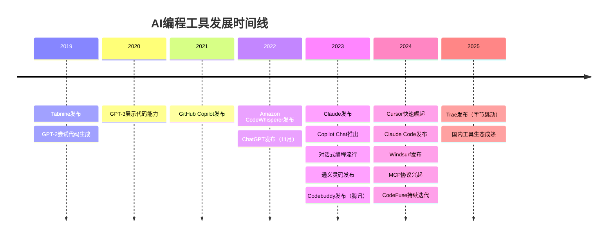

# 主流AI编码工具介绍

## 本章要点

这一章，我想带你去逛一逛AI编程工具的"兵器库"。你会看到一个行业是如何在短短几年内从无到有建立起完整的工具生态，了解各个阶段最具代表性的工具，以及它们分别适合什么样的开发者。最重要的是，读完这一章，你应该能够根据自己的需求，选择一个最适合自己的起点。

## AI编程工具的黎明：从幻想变成现实

如果我把时间倒回2018年，那时候如果你说"让AI帮我写代码"，大多数人会以为你在讲科幻小说。代码编辑器里的自动补全？那只是根据你已经输入的字符猜测你接下来可能输入的单词，本质上和你手机的输入法预测没什么区别。

但技术的进步往往就是这样悄无声息地发生。当GPT-2在2019年初发布时，已经有人开始尝试让它输出代码片段。虽然效果惨不忍睹——生成的代码多半是语法错误的"伪代码"——但它证明了方向是对的：大语言模型确实有理解代码结构的潜力。

真正的转折点发生在2020年。GPT-3出现了，这个拥有1750亿参数的"巨无霸"首次展现出了令人惊叹的代码生成能力。人们在社交媒体上分享各种演示：给GPT-3一个函数名和注释，它能生成合理的实现；描述一个简单的需求，它能给出可以运行的Python脚本。这些演示像是在告诉全世界：电影里的情节，真的发生了。

从那一刻起，AI编程工具的军备竞赛正式拉开帷幕。

## 第一波浪潮：代码补全工具的崛起（2021-2022）

### GitHub Copilot：开创者的诞生

2021年6月，GitHub与OpenAI联合宣布了GitHub Copilot。这个名字本身就是一种宣言——Copilot，副驾驶。你不是把方向盘交给AI，而是让AI坐在副驾驶座上，在你需要的时候给你递上一段代码。

Copilot的核心功能在第一节中你已经了解了：它根据你已写的代码上下文，自动补全接下来可能需要的代码。但它在技术上的意义远不止于此。Copilot背后的模型是由OpenAI和GitHub联合训练的，训练数据来源于GitHub上的公开代码仓库。这意味着，它不只是从一般文本中学习编程，而是专门"读"了海量真实的代码，学习了程序员真实的编程习惯。

你可以这样使用Copilot：

```python
# 你写下一行注释
# 读取CSV文件并返回前N行数据

# 然后停顿一下，Copilot会自动补全：
def read_csv_head(file_path, n=5):
    import pandas as pd
    df = pd.read_csv(file_path)
    return df.head(n)
```

Copilot的出现引发了巨大的讨论。有人欢呼，认为这是生产力的革命；有人担忧，担心这会让程序员变成"只会按Tab键的人"；还有人质疑它生成的代码会不会侵犯开源项目的版权。这些讨论至今仍在继续，但有一个事实是确定的：Copilot开创了一个全新的产品品类，从此"AI编程助手"不再是一个模糊的概念，而是一个可以实际使用的工具。

### Tabnine：默默耕耘的先行者

在Copilot获得广泛关注的同时，另一个工具早在更早的时候就已经开始探索这片领域。Tabnine成立于2017年，比Copilot早了整整四年。当OpenAI还在训练GPT-2的时候，Tabnine就已经在用深度学习模型做代码补全了。

Tabnine的策略与Copilot有所不同。它支持离线运行，可以在本地部署，这对于有数据安全要求的企业来说是重要的卖点。它还支持更多的编程语言和IDE，甚至可以在你的终端里使用。但Copilot背靠GitHub和OpenAI这两个巨头，加上背后模型的强大能力，很快就抢走了大部分公众的注意力。

Tabnine的坚持告诉我们：AI编程工具不只是一种形态。云端服务方便强大，本地部署安全可控，不同的用户有不同的需求，工具市场远没有到"赢家通吃"的时候。

目前我负责的CodeFuse，为何会有商业化市场？也是因为许多大公司特别是金融行业的客户，他们认为云上并不安全，企业要求所有的数据必须落为本地，才有我们的一方市场。

### Amazon CodeWhisperer：云计算巨头的入场

2022年，Amazon发布了CodeWhisperer，加入了这场竞争。作为云计算领域的巨头，Amazon的优势在于它对开发者工作流程的深度理解。CodeWhisperer深度集成在AWS的开发环境中，能够根据你的代码上下文和注释建议代码，特别擅长生成与AWS服务交互的代码。

CodeWhisperer的另一个特点是它内置了安全扫描功能。当它生成代码时，会自动检测潜在的安全漏洞，比如SQL注入风险、敏感信息泄露等。这在当时是一个差异化的卖点——不只是帮你写代码，还帮你写得更安全。

*注：这个工具因为差劲的安全性，经常被用来2API :(。*

## 第二波浪潮：对话式编程的革命（2023）

### ChatGPT：改变一切的时刻

2022年11月30日，OpenAI发布了ChatGPT。两个月后，它的月活跃用户突破了1亿，成为历史上增长最快的消费级应用。这个事件的意义远远超出了聊天机器人本身——它从根本上改变了人们与AI互动的方式。

对于程序员来说，ChatGPT带来的改变是革命性的。你可以直接用自然语言描述你的需求，它给你生成代码；你可以把报错信息发给它，它告诉你错在哪里；你可以粘贴一段看不懂的代码，它逐行给你解释。

这些功能听起来并不新鲜，但体验上的差距是巨大的。在ChatGPT之前，你需要在代码编辑器和浏览器之间来回切换，在搜索引擎和Stack Overflow之间翻找答案。现在，一切都在一个对话框里完成。你甚至不需要知道精确的技术术语——如果你不知道某个功能叫什么，描述你想要的效果就够了。

当然，ChatGPT作为编程工具有它明显的局限。它不能直接访问你的代码文件，每次对话有长度限制，你需要在聊天框里粘贴代码、复制结果。这种"割裂感"让很多人开始期待：如果AI能直接嵌入到代码编辑器里，该有多好？

### Claude：另一个选择

2023年3月，Anthropic发布了Claude。与OpenAI不同，Anthropic从一开始就把"安全"和"有帮助"作为核心设计理念。Claude的上下文窗口更大（初期就有10万token，后来扩展到20万），这意味着它可以一次性处理更长的代码文件。Claude的代码能力也很强，在某些编程任务上甚至超过了GPT-4。

Claude的另一个特点是其独特的"性格"。它被训练得更加谨慎，更愿意承认自己不知道的事情，更不愿意给出可能有害的建议。对于代码生成来说，这种谨慎有时是优点（减少错误），有时是缺点（过于保守）。但不可否认，它为用户提供了除ChatGPT之外的另一个强力选择。

### 对话式编程带来的思维转变

ChatGPT和Claude的流行，带来了一种全新的编程思维方式。人们在社交媒体上分享各种"提示词技巧"：如何让AI生成更好的代码、如何让AI帮你调试、如何让AI解释复杂的概念。一个新的概念开始流行：**提示词工程（Prompt Engineering）**。

这种思维方式的核心转变在于：你不再需要自己写每一行代码，但你必须学会如何精确地描述你想要什么。这就像是管理一个远程团队——你不需要亲自做每一个任务，但你必须能够清晰地传达你的要求，审核团队成员的产出，给出准确的反馈。

## 第三波浪潮：AI原生开发环境（2024至今）

如果说前两波浪潮是在现有开发工具上"加装"AI功能，那么2024年开始的第三波浪潮则是彻底重新构想开发环境应该是什么样子。

### Cursor：第一个真正的"AI原生"IDE

Cursor的诞生标志着AI编程工具进入了一个新阶段。它不是给现有编辑器加装一个插件，而是从头开始构建一个"以AI为核心"的代码编辑器。

打开Cursor，你会发现它看起来和VS Code几乎一模一样。这不是巧合——Cursor是基于VS Code的源代码构建的，所以你现有的所有VS Code习惯、主题、快捷键都可以无缝迁移。但当你真正开始使用它时，你会感受到巨大的不同。

在Cursor里，AI不是你需要手动调用的功能，而是无处不在的助手。你可以用 `Cmd+K`（Mac）或 `Ctrl+K`（Windows）在任何位置唤起AI，让它帮你生成或修改代码。你可以选中一段代码，直接用自然语言告诉AI你想怎么改。你甚至可以打开聊天模式，让AI理解你的整个项目，回答有关代码结构、依赖关系的问题。

Cursor最让人兴奋的功能是**代码库级别的理解**。当你在编写代码时，Cursor会在后台自动分析你的整个项目，理解文件之间的关系、代码的组织模式。这意味着，当你让AI帮你添加一个新功能时，它不会凭空生成代码，而是遵循你项目现有的风格和模式。这就像是有一个同事已经和你共事了几个月，对你的代码风格了如指掌。

### Claude Code：AI Agent的雏形

2024年末，Anthropic发布了Claude Code。这个工具更进一步模糊了"AI助手"和"独立代理人"之间的界限。

Claude Code最大的特点是它具备**行动力**。它不再只是给你建议，让你自己执行；它可以直接帮你创建文件、运行命令、执行测试、查看结果。你只需要用自然语言告诉它你想做什么，它会自己规划步骤、执行操作、处理问题，最后向你汇报结果。

想象一下这样的场景：你告诉Claude Code"帮我给这个项目添加一个用户登录功能"。它会先分析你的项目结构，理解现有的代码组织方式，然后规划需要创建哪些文件、修改哪些代码。它会一步步执行，每一步都很小心，遇到问题时会自己尝试解决或者向你求助。整个过程就像你和一位人类同事在协作。

当然，Claude Code的设计非常注重安全。所有的操作都需要你的确认，重要的修改会先展示给你审核。你始终保持着最终的控制权——方向盘仍然在你手里。

### Windsurf：多文件协作的新尝试

在同一时期，Codeium推出了Windsurf，这是另一个试图重新定义AI编程体验的工具。Windsurf的焦点是多文件协作——当你修改一个文件时，AI能够理解这个修改会如何影响其他文件，并给出同步修改的建议。

这种能力听起来简单，实则非常复杂。在大型项目中，一个函数的改动可能影响到十几个文件。传统的方式是：你改完一个文件，编译或运行时发现错误，再去其他文件里修改。Windsurf试图把这个过程自动化——当你改了一个地方，AI会主动告诉你"嘿，那边还有一个地方可能需要同步修改"。

### GitHub Copilot的进化

面对这些新秀的挑战，GitHub Copilot也在快速进化。Copilot X在2023年宣布，后来逐步以Copilot Chat等功能形式发布。它不再只是代码补全工具，而是一个完整的编程助手：可以对话、可以解释代码、可以帮你写测试、可以帮你审查代码的安全性。

更重要的是，Copilot深度集成了GitHub的整个开发生态。它可以访问你的Issues、Pull Requests、文档，回答关于项目的问题。你甚至可以在终端里和Copilot对话，让它帮你理解复杂的命令或者生成shell脚本。

GitHub显然不想在AI编程工具的市场中落后。它拥有一个独特的优势：每一个开发者几乎都已经在使用GitHub。这让它有潜力把AI助手嵌入到开发流程的每一个环节——从编写代码，到审查代码，到部署上线。

### 国内市场：本土化AI编程工具的崛起

前面介绍的工具大多来自美国科技公司，但在中国市场，也涌现出了一批本土化的AI编程工具。这些工具的出现，既有技术发展的必然性，也有独特的市场背景。

#### Trae：字节跳动的AI原生IDE

2025年初，字节跳动发布了Trae，这是一款真正"AI原生"的集成开发环境。与Copilot作为插件嵌入现有编辑器不同，Trae从设计之初就将AI作为核心——整个编辑器的交互逻辑都围绕"与AI协作"来构建。

打开Trae，你会发现它有两种核心模式。**Builder模式**适合从零开始创建项目：你描述你想要的应用，Trae会帮你规划架构、创建文件、生成代码，并通过内置的预览功能让你实时看到效果。**Chat模式**则更像是和一个精通你项目的工程师对话：你可以问它任何关于代码的问题，它会结合你的项目上下文给出回答。

Trae的另一个亮点是对中文的支持。由于底层模型在大量中文数据上进行了训练，Trae对中文需求的理解更加精准，生成的代码注释也更符合中国开发者的习惯。对于国内开发者来说，这是一个重要的加分项。

#### Codebuddy：腾讯的智能编程伙伴

Codebuddy是腾讯推出的AI编程助手，深度集成在腾讯云的开发者工具生态中。它的定位是一个"懂你"的编程伙伴——不仅仅能补全代码，还能理解你的开发上下文，给出更贴合实际场景的建议。

Codebuddy的几个亮点值得一提。首先是**多模型支持**，它背后接入了多个大语言模型，可以根据不同的任务类型选择最合适的模型，这让它在不同场景下都能保持良好的表现。其次是**安全合规**，对于金融、政务等对数据安全要求极高的行业，Codebuddy支持私有化部署，代码可以在企业内网环境中处理，不必发送到公共云服务。

Codebuddy还能与腾讯云的其他服务深度集成。如果你使用腾讯云的代码托管、CI/CD流水线、云函数等服务，Codebuddy能够帮你快速生成与这些服务交互的代码，减少查阅文档的时间。对于已经深度使用腾讯云的团队来说，这是一个不可忽视的便利。

#### 通义灵码：阿里云的开发者赋能

阿里云推出的通义灵码（Tongyi Lingma）是另一个重要的国产AI编程工具。它基于阿里的通义大模型，深度集成在阿里云的开发者工具生态中。

通义灵码的一个特点是它对阿里云服务的"熟悉"。如果你经常使用阿里云的各种产品——OSS对象存储、RDS数据库、函数计算等——通义灵码能够帮你快速生成与这些服务交互的代码，减少查阅文档的时间。它还支持智能问答，可以回答关于云计算、架构设计的各种问题。

#### CodeFuse与本土化的意义

作为蚂蚁集团推出的AI编程助手，CodeFuse代表了另一种思路。它不仅仅是一个面向个人开发者的工具，更是一个面向企业级应用开发的解决方案。

CodeFuse特别注重与企业内部系统的集成。在企业环境中，代码往往需要与内部的框架、中间件、监控系统集成——这些是外部AI工具所不了解的。CodeFuse可以学习企业内部的代码模式和最佳实践，生成更贴合企业需求的代码。

我在前面提到过，CodeFuse的市场机会很大程度上来自于企业对数据安全的重视。很多大型企业，特别是金融行业，明确要求代码不能离开内网环境。这为本地化部署的AI编程工具创造了独特的市场空间。

#### 国内工具的共同特点

总结这些国产AI编程工具，你会发现它们有一些共同的特点：

**安全合规优先**。无论是Codebuddy、通义灵码还是CodeFuse，都把"代码不出域"作为核心卖点。这既是应对监管要求的必然选择，也是国内企业的真实需求。

**中文体验优化**。从界面的中文本地化，到对中文需求理解的各种优化，再到符合中国开发者习惯的代码风格，这些工具在细节上更贴近国内用户。

**与云端服务集成**。无论是阿里云、腾讯云还是字节跳动，这些工具都能与自家云服务深度集成，形成完整的开发者体验。如果你已经深度使用了某个云平台，选择它配套的AI编程工具往往能获得额外的便利。

**适应本土开发环境**。国内企业的开发环境往往有独特的技术栈和流程——比如特定的框架版本、内部构建系统、独特的代码规范。国产AI工具在适配这些本土化需求上有天然优势。

## 工具全景图

讲了这么多工具，我想用一个图表来帮你建立整体的概念：



## 如何选择适合你的工具？

面对这么多的选择，你可能会问：我该用哪一个？这个问题没有标准答案，但我可以给你一些思考的维度。

### 如果你刚开始学习编程

我建议从一个对话式工具开始，比如ChatGPT或Claude。为什么呢？因为你现阶段的主要任务是理解概念、学习语法、完成简单的练习。对话式工具让你可以更自然地提问、获得解释、理解代码的含义。你不需要复杂的IDE功能，一个可以随时提问的"AI老师"就够了。

在这个阶段，我更推荐使用Claude。它的解释更详细，更适合初学者理解。而且它的上下文窗口更大，你可以一次性发送更长的代码让它解释。

### 如果你已经熟悉编程，想提高效率

如果你已经写了一段时间的代码，正在寻找提高效率的工具，那么代码编辑器内的AI助手是你的选择。GitHub Copilot是最稳妥的选择：生态成熟，支持的语言和IDE最多，背后有大公司持续投入。

在使用Copilot时，我建议你培养这样的工作习惯：先写下清晰的注释描述你想做什么，然后让AI来补全。这种方式让AI更容易理解你的意图，也让你自己更清楚地思考问题。

### 如果你想尝试最前沿的体验

如果你喜欢尝鲜，想体验最新的AI编程方式，那么Cursor或Claude Code会让你感到兴奋。这两个工具代表了当前AI编程的前沿方向，它们展示了一个可能的未来：AI不再只是"补全工具"，而是真正的"编程伙伴"。

Cursor更适合日常开发，它的编辑器体验非常流畅，你可以根据需要选择使用AI的频率和方式。Claude Code更适合处理复杂任务，比如创建新项目、重构大段代码、或者探索一个陌生的代码库。

### 如果你关注数据安全与合规

如果你在金融、政务或其他对数据安全有严格要求的行业工作，那么国内工具可能是更合适的选择。

对于已经深度使用阿里云的企业，通义灵码能够与你的云端服务无缝集成。如果你是腾讯云的用户，Codebuddy提供了与腾讯云生态深度集成的体验。如果你希望有一个全新的、AI原生的编辑器体验，同时支持中文交互，字节跳动的Trae值得一试。

如果你所在的企业有私有化部署的需求——代码绝对不能离开内网——那么Codebuddy、CodeFuse这类支持本地部署的工具是必须的选择。虽然部署和维护成本会高一些，但对于很多企业来说，这是不可妥协的底线。

### 重要提醒：没有最好的工具，只有最合适的工具

我想强调一件事：**工具只是工具**。选择一个AI编程工具，就像选择一个代码编辑器——VS Code很好，但有人喜欢Vim；IntelliJ很强，但有人偏爱轻量级的编辑器。重要的是找到那个让你感到舒适、高效的工具。

而且，你完全可以同时使用多个工具。很多人在日常工作中会用Cursor或VS Code配合Copilot来写代码，遇到复杂问题时打开Claude或ChatGPT进行深入讨论，需要快速调试时用终端里的AI助手。这些工具不是互斥的，而是互补的。

## 未来会变成什么样？

在结束这一章之前，我想和你聊聊对未来的展望。回顾过去几年的发展速度，我甚至不敢预测太远的未来。但有一些趋势是清楚的。

**AI会越来越"懂"你的项目**。现在，AI工具已经能够理解你整个代码库的结构。未来，它们会更深入地理解你的业务逻辑、代码风格、技术债务。每次交互，AI都在学习和适应你的工作方式。

**AI会有更强的行动能力**。现在，AI工具已经可以帮你创建文件、运行命令。未来，它们可能会帮你完成更复杂的任务链条：理解需求、设计方案、编写代码、运行测试、修复bug、写文档、提交代码——所有这些，都在你的审核和确认之下进行。

**人机协作会成为默认工作模式**。就像现在我们很少见到不用版本控制的编程团队一样，未来我们可能会很少见到不用AI助手的程序员。不是AI替代程序员，而是不懂用AI的程序员被懂用AI的程序员替代。

## 小结

这一章，我们一起回顾了AI编程工具的发展历程。从2019年Tabnine的探索，到2021年GitHub Copilot的开创，再到2023年ChatGPT带来的对话式革命，以及2024年Cursor和Claude Code代表的AI原生体验——短短五年时间，这个领域经历了从无到有、从简到繁的跨越式发展。

我们了解了各个阶段最具代表性的工具：Tabnine的先行探索、Copilot的代码补全、ChatGPT的对话革命、Cursor的AI原生编辑器、Claude Code的行动能力、Windsurf的多文件协作。每一个工具都在不同的维度上拓展了AI编程的边界。

我们也把目光投向了国内市场，了解了Trae、Codebuddy、通义灵码、CodeFuse等本土化工具。它们在数据安全、中文体验、与国内云服务集成等方面有着独特的优势，为国内开发者提供了更多选择。

我们讨论了如何选择适合自己的工具。对于初学者，从对话式工具开始；对于有经验的开发者，选择编辑器内嵌的AI助手；对于关注数据安全的企业用户，选择支持私有化部署的国内工具；对于喜欢尝鲜的人，尝试Cursor、Claude Code或Trae这样的前沿工具。重要的是找到适合你当前阶段和工作习惯的选择。

在下一章，我们将真正动手：让AI帮你写出第一段代码。别担心，我会一步步带你完成这个过程。

## 练习

在进入下一章之前，我想请你做几件事：

**调研题**：选择本章介绍的一个你还没使用过的工具，去它的官网逛一逛。看看它的定价策略是怎样的？免费版和付费版有什么区别？它支持哪些编程语言和IDE？把这些信息记录下来，你会发现不同工具的定位和策略各有侧重。

**对比题**：如果你已经在使用某个AI编程工具，请尝试另一个同类工具。比如，如果你平时用Copilot做代码补全，试试国产的通义灵码或Codebuddy。用同一个任务测试它们——比如"写一个函数来解析JSON配置文件"。对比一下：它们的响应速度、代码质量、对中文需求的理解有什么不同？你更喜欢哪一个？

**思考题**：假设你是一家初创公司的技术负责人，团队有5个人，预算有限，代码涉及一些商业机密。你会选择哪个AI编程工具？为什么？考虑因素包括：成本、安全性、易用性、与现有工具链的集成等。这个思考会帮助你建立选择工具的思维框架。