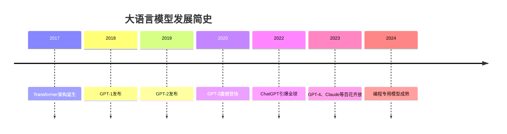
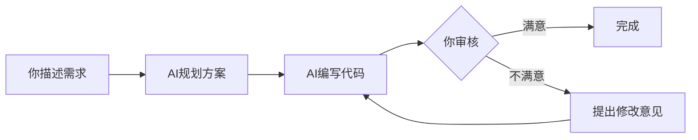
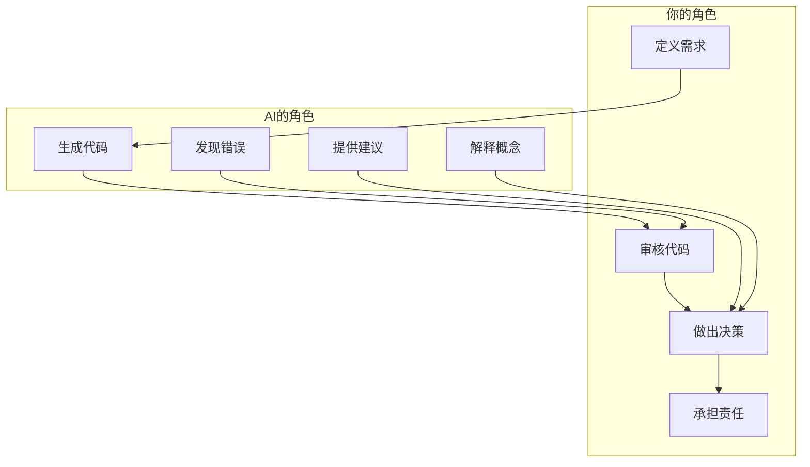

# 为什么用AI辅助编程

## 本章要点

通过这一章，我希望带你理解四件事：大语言模型是如何从"聊天机器人"成长为"编程助手"的；AI编程工具经历了怎样的演进过程；AI辅助编程能为我们带来什么真正的价值；以及——也许是最重要的——明白AI擅长什么、不擅长什么，建立对它的正确期待。

## 从"聊天机器人"到"编程助手"

### 大模型的诞生

如果你用过ChatGPT，你可能已经体验过与AI对话的感觉。那种随时随地都能得到回应的体验，对很多人来说既新奇又便利。但你有没有想过：为什么这个能陪你聊天、帮你写邮件的AI，突然就能帮你写代码了？代码可不是随随便便的文字，它需要精确的语法、严密的逻辑，一行错就可能让整个程序崩溃。

这一切要从**大语言模型（Large Language Model，简称LLM）**说起。



时间回到2017年，Google的研究团队发表了一篇划时代的论文，提出了**Transformer架构**。在这之前，AI处理文本的方式有点像"失忆症患者"——它读到一个词，很快就会忘记前面讲过什么。Transformer的核心创新是引入了"注意力机制"，让模型能够理解文本中词语之间的关系，就像你阅读时会关注上下文一样。当你读到"他"这个词时，你会自然地回头看看"他"指的是谁；Transformer让AI也拥有了类似的能力。

有了这个基础，OpenAI开始了GPT系列模型的研发之旅。GPT这个名字本身就是这种理念的写照：Generative Pre-trained Transformer，生成式预训练变换器。每一代模型都在向更大的规模迈进。

**GPT-1**在2018年问世，它的最大贡献是证明了"预训练+微调"这条路可行。所谓预训练，就是让模型先在海量文本上学习语言的规律，就像一个人在开口说话前已经听了千万句话一样。不过GPT-1的能力还很有限，写出的句子经常前言不搭后语。

一年后，**GPT-2**登场，参数量增加到了15亿。它已经能生成相当连贯的文章，如果你给它一个开头，它能写出一段看起来挺像那么回事的续写。但说到写代码？它还完全摸不着门道。代码需要的是另一种精确性。

真正的转折点出现在2020年。**GPT-3**的参数量达到了惊人的1750亿，训练它的计算成本据估计超过千万美元。这个"巨无霸"首次展现出了令人惊叹的编程能力：给它一个函数名和一段注释，它竟然能补全出合理的代码实现。许多人第一次看到这个演示时，都有一种"科幻小说变成现实"的感觉。

这里发生了一件有趣的事情。研究人员并没有专门教GPT-3写代码，他们只是给它看了很多文本，其中恰好包含大量代码。但当模型足够大、训练数据足够丰富时，它会"涌现"出意想不到的能力——编程就是其中最引人注目的一个。这就像一个孩子原本只是想学会阅读，却意外发现自己也能写作一样。

### 为什么大模型能写代码？

这是一个很多人都会问的问题。大模型是用海量文本训练的，学习的是语言规律，为什么能写出逻辑严密的代码？

答案说起来其实很简单：**代码本质上也是语言**。

想想看，代码和自然语言有着惊人的相似之处。它们都有语法结构——英语有主谓宾，Python有if-else缩进；它们都有语义和上下文——一个变量的含义取决于它在哪里被定义、被如何使用；它们都需要逻辑推理——写文章要讲究因果关系，写代码更是如此，每一步都要前后呼应。

当模型阅读了GitHub上数以亿计的代码文件后，它获得的不仅仅是"记住"了这些代码，而是学会了代码背后的规律：什么样的代码结构是"合理"的，一个叫`calculate_average`的函数大概应该做什么事情，一行注释和它下面的代码有什么对应关系，以及当代码出现错误时如何定位和修正。

打个比方，想象一个从未学过烹饪的人，但他读过全世界所有的菜谱。他可能说不出"爆炒"和"煎"的理论区别，但如果你告诉他"要做一道家常的番茄炒蛋"，他能给你写出一份看起来相当靠谱的菜谱。大模型写代码的道理与此相似——它通过"阅读"学会了"写作"，不仅是写文章，还包括写代码。

当然，这种学习方式也有它的局限，我们稍后会详细讨论。

## AI编程工具的演进

大模型的能力令人振奋，但对于普通人来说，怎么才能用它来编程呢？这就涉及到了AI编程工具的发展历程。让我们看看这个领域是如何一步步走来的。

### 第一阶段：代码补全（2021年）

最早的AI编程工具以**代码补全**为主要形式。2021年，GitHub与OpenAI合作推出了**GitHub Copilot**，这个名字起得很有意思——Copilot，副驾驶。它的定位很清晰：你仍然是驾驶员，但旁边有一个帮你导航的人。

它的核心功能是这样的：你写几行代码或者一段注释描述你想要什么，AI帮你补全剩余的部分。具体来说，你可以这样用：

```python
# 你只需要写一个函数签名和注释
def calculate_average(numbers):
    """计算列表的平均值"""
    # AI会自动补全函数体
    if not numbers:
        return 0
    return sum(numbers) / len(numbers)
```

看起来很神奇，对吧？但早期的Copilot更像是一个"智能猜测器"。它根据你已写的代码上下文，猜测你接下来想写什么。有时候猜得非常精准，让你感觉它读懂了你的心思；但有时候也会给出一些令人啼笑皆非的建议，让你怀疑它是不是在胡言乱语。

这个阶段的AI有一个明显特点：它能帮你写，但它不能帮你想。你得自己知道要写什么，只是把"敲键盘"的活儿外包给它。

### 第二阶段：对话式编程（2023年）

2023年，ChatGPT的爆火彻底改变了人们使用AI的方式。突然之间，你不需要在代码编辑器里等待AI补全了，你可以直接**和AI对话**，告诉它你想做什么，让它帮你写代码。

这种改变看似简单，实则意义深远。想想传统的编程学习路径是什么样的：先学习一段时间的语法规则，理解各种编程概念，熟悉开发工具，做几个练习项目，然后才能开始写一些"真正有用"的东西。这个过程可能持续几周甚至几个月。

但现在呢？你只需要清晰地描述你想做什么，AI就能生成相应的代码。你想爬取一个网页的数据？告诉AI，它给你代码。你想写一个处理Excel文件的脚本？描述需求，代码就来了。遇到了一个报错？把错误信息发给AI，它会告诉你问题出在哪里、该怎么改。

更棒的是，这个阶段的AI不再只是"写"，它还能"教"。你可以让它解释每一行代码的作用，让它告诉你为什么用这种方法而不是那种，让它帮你理解那些看不懂的代码片段。学习编程的方式从"先学后用"变成了"边用边学"。

| 传统编程学习 | AI辅助下的编程学习 |
|---------|-----------|
| 先学习语法规则，然后才能开始写代码 | 描述需求，AI生成代码，你边用边理解 |
| 遇到问题要搜索文档、查Stack Overflow | 直接问AI"为什么报错"、"这段代码什么意思" |
| 一行一行敲代码，效率较低 | 一段一段生成代码，效率大幅提升 |
| 自己琢磨代码的含义 | AI主动解释每一行的作用 |

### 第三阶段：智能编程助手（2024年至今）

如果你以为这就是终点，那就太小看技术发展的速度了。现在，我们正处于AI编程工具的第三个阶段，而且这个阶段还在快速演进中。

**Claude Code**、**Cursor**等新一代工具带来了一个质的飞跃：它们不再是"附在"代码编辑器上的插件，而是成为了开发环境本身的一部分。这意味着什么？意味着AI现在能**理解整个项目**——不再局限于你正在编辑的那一个文件。

想象一下这种场景：你让AI帮你添加一个新功能，它不只是机械地生成一段代码，而是先理解你的项目结构，看看现有的代码是如何组织的，然后遵循已有的模式来编写新功能。甚至，它还能帮你运行测试、发现错误、自动修复，最后再让你确认是否满意。整个流程就像是你和一个人类同事在协作：你提需求，他出方案，你审核，他修改，直到达成共识。



这个阶段最让人兴奋的是AI获得了"行动力"。它不再只是给你输出文本建议，而是能直接帮你创建文件、运行命令、执行测试。你不再需要在AI给你的代码和你的开发环境之间来回切换，一切都在同一个界面里完成。当然，为了安全起见，重要的操作仍然需要你确认，你始终保持着最终的控制权。

## AI辅助编程的核心价值

说了这么多工具的演进，我们还是来聊聊核心问题：为什么AI辅助编程值得你花时间学习和掌握？它能给我们带来什么真正的价值？

### 降低编程门槛

这是最直观、也最根本的改变。在过去，学习编程就像学习一门外语加上一门手艺。你需要投入大量时间先理解编程语言的语法规则，然后学习各种编程概念（什么是变量、函数、循环、条件判断），熟悉开发工具（怎么配置环境、怎么调试代码），最后还要通过实际项目积累经验。对很多人来说，这个门槛高到足以让他们在入门之前就放弃了。

AI辅助编程把这个门槛大大降低了。你不需要先背熟语法，不需要先理解所有概念，甚至不需要配置复杂的开发环境。你只需要做一件事：**清晰地描述你想要什么**。然后，AI会帮你生成代码，你负责审核、学习、理解。

请注意，这不是说不需要学习编程了——恰恰相反，你仍然需要理解代码在做什么，否则你无法判断AI给的结果是否正确、是否符合你的需求。

就像我之前写在我自己的备忘录中的信条一样：

**告诉AI Need，不要告诉AI Think。**

**永远不要相信AI写的内容，是你主导AI，不是AI主导你。**

但这种理解可以在实践中逐步建立，而不是必须先学完一堆理论才能开始动手。"用中学"比"学后用"有效率得多，也有趣得多。

### 提升开发效率

即使是那些已经写了多年代码的资深程序员，AI也能显著提升他们的工作效率。为什么？因为编程工作中有大量的"有规律可循"的重复性劳动。

想想看，你写过多少次类似的CRUD操作（增删改查）？你写过多少次配置文件？你写过多少次样板代码？这些东西其实没什么技术含量，但就是需要人一个字一个字敲进去。现在好了，这些事情可以交给AI来做。根据实际经验，原本需要30分钟才能完成的任务，在AI辅助下可能只需要5分钟。

| 任务类型 | 传统方式耗时 | AI辅助后 | 效率提升 |
|---------|------------|---------|---------|
| 写一个标准CRUD接口 | 30分钟 | 5分钟 | 6倍 |
| 解析一个复杂的JSON结构 | 15分钟 | 2分钟 | 7倍 |
| 编写单元测试 | 20分钟 | 3分钟 | 6倍 |
| 重构一段代码 | 1小时 | 10分钟 | 6倍 |

节省下来的时间可以被投入到更需要创造力、更需要人类判断的工作上：理解业务需求、设计系统架构、优化用户体验、处理复杂的edge case。这些工作是AI目前还很难做好的，也是人类程序员的核心价值所在。

### 知识获取更便捷

在AI出现之前，遇到一个编程问题，你的解决路径是什么样的？打开搜索引擎，输入关键词，在一堆搜索结果里翻找，点开一个Stack Overflow问答，发现问题描述和你的不太一样，再点开另一个，发现回答已经过时了，又换一个……整个过程可能要花上十几分钟甚至更久。

更令人沮丧的是，找到答案之后，你往往还需要花时间理解它如何应用到你的具体场景中。那个答案说的是一般情况，但你的代码有特殊的上下文，有特殊的约束，需要你来调整。

有了AI之后，这个过程变得直接得多。你可以把你的代码片段连同错误信息一起发给AI，它会给你针对性的回答。它不需要你把问题抽象成通用的关键词，因为它能直接"看"你的代码。它给你的解释会结合你的具体场景，甚至能告诉你为什么你的代码会出错、以及该怎么改。知识获取从"搜索-理解-应用"变成了直接"询问-获得解答"。

### 减少"卡住"的时刻

每个写过代码的人都有过这样的经历：一个明明很简单的错误，你却找了两个小时都没发现原因。最后，可能是一个拼写错误，可能是一个分号多了或少了，可能是一个变量名写错了……这些低级错误的共同特点是：**你越是盯着看，越是看不见**。你的眼睛已经习惯了这段代码，自动脑补了正确的内容。

这时候，一个没有"先入为主"的AI助手就特别有用。它用全新的眼光看你的代码，更容易发现那些你已经"视而不见"的错误。更重要的是，在排查过程中，AI不只是替你找错误，它还能解释为什么这是一个错误、这种错误通常是怎么产生的、以后该怎么避免。你在解决问题的同时也在学习。

## AI编程的适用场景

了解了AI编程的价值，我们还需要建立一个清醒的认识：AI不是万能的。知道什么时候该用、什么时候不该用AI，是成为一个高效的AI辅助编程者的关键。

### 非常适合的场景

AI在以下场景中表现尤其出色：

**快速原型开发**。当你有一个想法，想快速验证它是否可行时，AI可以帮你快速搭建一个原型。你不需要纠结完美的架构、最优的算法，你只需要看到想法是否能跑通。

**学习新技术**。当你进入一个不熟悉的领域时，AI可以充当一个耐心的导师。它可以给你展示基础代码示例，解释概念，回答你的问题，帮你快速上手。

**重复性代码编写**。那些CRUD操作、样板代码、配置文件，让AI来写既快又准。程序员的时间应该花在更有价值的地方。

**代码理解**。当你接手别人的代码，或者阅读一个开源项目的源码时，AI可以帮你解释那些复杂的逻辑，让你更快理解代码的意图。

**调试与修复**。程序出bug了？AI可以帮你分析错误信息、建议排查方向、提供可能的修复方案。它就像一个随时在线的结对编程伙伴。

**文档编写**。写文档大概是程序员最不愿意做的事情之一了。现在，AI可以根据代码自动生成文档和注释，你只需要审核和补充。

### 需要谨慎的场景

有些场景需要你格外小心：

**安全关键系统**。如果你的代码涉及金融交易、医疗数据、隐私信息等敏感领域，那么AI生成的代码必须经过比平常更严格的审查。AI不会主动考虑合规性、数据保护这些关键问题。

**性能敏感场景**。AI生成的代码通常是"能工作"的，但未必是"最优"的。如果你的代码需要极致的性能优化，AI的建议可能不够好，需要更专业的调优。

**非常规需求**。如果你的项目有非常特殊的约束或惯例，AI可能不了解这些背景信息。这时候你需要花更多时间向AI解释上下文，或者干脆自己写。

**代码保密要求**。如果你在处理商业机密或其他敏感代码，发送给云端AI服务之前要三思。大多数AI服务会使用用户的对话数据来改进模型，虽然会做匿名化处理，但风险仍需考虑。在蚂蚁集团之内，目前规定的是：只要是内部代码仓库的代码，使用外部大模型，则会直接触发：**三级数据违规**！

### AI做不到的事

最后，有些事情AI目前还做不了，你需要自己来：

**替代你的思考**。AI可以帮你写代码，但不能替你思考问题。你仍然需要理解代码在做什么、为什么这样做。

**保证100%正确**。AI生成的代码可能有bug，可能有逻辑错误，可能不符合你的真实需求。测试、验证、审核仍然是你的责任。

**理解你的业务背景**。AI不知道你们的业务规则、用户习惯、技术债务……除非你明确告诉它。这些"上下文"需要你来提供。

**做出架构决策**。一个项目应该用什么技术栈、怎么划分模块、怎么设计接口……这些重大的技术决策需要人来判断，AI只能提供建议。

## 正确的期望

在结束这一章之前，我想和你分享一个比喻，这可能会帮助你建立对AI编程的正确期望。

**AI是副驾驶，不是机长。**

在一架飞机上，机长负责做出所有重大决策：选择航线、应对天气变化、处理紧急情况。副驾驶提供支持：操作仪表、监控数据、提供建议。这个分工很有参考意义。



你是机长。你决定要做什么（定义需求），你判断AI给的方案是否满足需要（审核代码），你做出最终的决策（做还是不做、用哪个方案），你对结果负责（代码出了问题，AI不会被抓去坐牢）。AI是副驾驶，它提供支持：生成代码、给建议、解释概念、发现错误。但它永远不能代替你来决定飞机往哪里飞。

这个比喻还有一个层面：副驾驶需要机长的信任和指导才能发挥作用。你越是能清晰地向AI表达你的需求、提供足够的上下文、给出明确的反馈，AI就越能给你有用的帮助。这是一个需要磨合的协作关系。

## 小结

这一章，我们一起走过了AI辅助编程的"前世今生"。

我们从大模型的诞生说起，看到了Transformer架构如何让AI拥有了"注意力"，GPT系列如何一步步发展壮大，以及在GPT-3时意外涌现出的编程能力——这一切的起点，是因为代码本质上也是一种语言，能用学习语言的方式学会。

我们回顾了AI编程工具的三个发展阶段：从最早的代码补全，到对话式编程的革命，再到今天智能助手的深度融合。每一步进化都让编程这件事变得更加平易近人。

我们讨论了AI辅助编程的核心价值：它降低了编程的入门门槛，提升了开发效率，让知识获取变得更直接，减少了被低级错误卡住的时刻。但我们也清醒地认识到，AI不是万能的——知道它的边界在哪里，才能更好地利用它。

最后，我们建立了一个重要的心态：AI是副驾驶，不是机长。你始终是编程工作的中心和决策者，AI是强大的助手，但方向盘在你手里。

在下一章，我将带你认识当前主流的AI编码工具，帮助你选择一个适合自己的起点。

## 练习

在进入下一章之前，我想请你思考几个问题。这些问题没有标准答案，但思考它们会帮助你更好地理解AI编程这件事：

**反思题**：回顾你过去学习或使用编程的经历，想想看，哪些任务如果交给AI来做会很合适？哪些任务你认为更需要人类来完成？为什么？

**实践题**：如果你还没有使用过AI编程工具，我建议你注册一个。Claude、ChatGPT、或者GitHub Copilot都可以。试着让它帮你写一段简单的代码——哪怕只是"写一个Python函数来计算斐波那契数列"这样的小任务。感受一下，这个过程中你的体验是什么？你有什么惊讶的发现吗？

**展望题**：想象一下，如果AI能帮你处理80%的编码工作，你会把节省下来的时间用来做什么？学习更深奥的技术？思考产品策略？还是干脆早点下班？这个问题没有对错，但认真地想一想，会让你对"为什么学AI编程"有更清晰的答案。