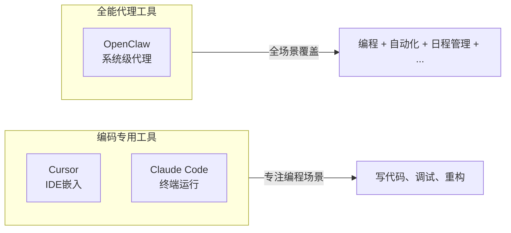

# OpenClaw：不止于编码的全能助手

## 本章要点

在前两章，我们分别认识了Cursor和Claude Code——一个是嵌入IDE的智能编程伙伴，一个是运行在终端里的代码执行代理。它们都专注于编程这一个场景。但如果你想要的不只是写代码呢？如果你希望AI能帮你管理日程、处理邮件、控制智能家居，甚至在你睡觉的时候默默工作？这一章，我要介绍一个与众不同的工具：OpenClaw。它不只是AI编程工具，而是一个24/7在线的个人AI助手，能做的事情远超代码编写。理解它的定位和能力，会帮你打开对AI助手的新认知。

## 从Clawdbot到OpenClaw：一个项目的诞生与蜕变

OpenClaw的故事始于2026年初。PSPDFKit的创始人Peter Steinberger做了一个有趣的项目：让AI不只是聊天，而是能在他的电脑上真正执行操作。他把这个项目叫做**Clawdbot**——一个对Anthropic Claude的俏皮致敬，灵感来自Claude Code加载时那个可爱的小龙虾钳子图标。

这个想法触动了很多人的神经。项目在24小时内获得了9,000个GitHub stars，几周内突破了60,000。人们兴奋地称它是"最接近JARVIS的东西"——那个钢铁侠电影里24小时在线、无所不能的AI管家。

但快速增长也带来了成长的烦恼。Anthropic的律师觉得"Clawd"这个名字有点太像"Claude"了，这可能导致商标混淆。于是项目更名为**Moltbot**——依然保留着龙虾主题（molt是蜕壳的意思）。没过几天，Steinberger决定他更喜欢**OpenClaw**这个名字。三个名字，大约一周时间——这就是2026年AI行业变化速度的一个缩影。

到2026年3月，OpenClaw已经成为GitHub历史上增长最快的开源项目之一，累计获得超过200,000颗星。更重要的是，它的社区贡献者已经为它开发了超过100个技能包，让这个工具能做的事情越来越丰富。

## OpenClaw是什么？

**OpenClaw是一个自托管、开源的AI代理运行时，它最大的特点是：不只是生成文本，而是真正执行操作。**

当你和ChatGPT聊天时，你得到的是建议和回答。当你使用Cursor或Claude Code时，AI能帮你读写代码、运行命令。而OpenClaw更进一步——它像一个不知疲倦的管家，能持续运行在你自己的机器上，通过你熟悉的聊天软件接收指令，执行各种任务。

让我用一个具体的场景来帮助你理解它的不同。

假设你正在度假，突然想起家里电脑上有一个重要文件需要整理并发送给同事。如果用传统方式，你需要远程登录电脑，找到文件，整理内容，写邮件发送。如果用ChatGPT，它只能告诉你怎么操作，但没法替你动手。如果用Cursor或Claude Code，你可以让AI帮你处理文件，但你需要打开编辑器，坐在电脑前。

而OpenClaw的体验是这样的：你在手机上打开Telegram或WhatsApp，给你的AI助手发一条消息："帮我把桌面上那个客户报告整理一下，发到我的工作邮箱。"OpenClaw接收到指令，在你的家里电脑上打开文件，整理内容，调用邮件服务发送——整个过程你只需要在手机上打一句话。

这就是"代理"和"助手"的本质区别：代理不只是回答你，而是代表你行动。

## OpenClaw vs Cursor vs Claude Code：三类工具的本质差异

理解OpenClaw的定位，最好的方式是把它和我们前面介绍的两类工具做一个对比。



### 设计哲学的差异

**Cursor和Claude Code的设计哲学是"编程优先"。** Cursor把AI能力嵌入到编辑器中，让你在写代码时获得最流畅的体验。Claude Code把AI带到终端里，让你用自然语言描述编程任务，AI帮你执行。它们都非常擅长理解代码、生成代码、调试代码，但对于代码之外的事情——管理你的日历、处理邮件、控制智能家居——它们并不在行。

**OpenClaw的设计哲学是"全能代理"。** 它不是为编程专门设计的，而是为"代替你操作电脑"设计的。编程只是它能做的众多事情之一。它同样能帮你写代码、调试程序，但当你说"帮我安排下周的会议"或"打开客厅的灯"时，它也能做到。

### 运行方式的差异

**Cursor**需要你打开编辑器才能工作。你坐在电脑前，打开Cursor，开始对话。当你关闭编辑器，AI就下班了。

**Claude Code**运行在终端里，理论上可以一直开着，但通常你也是用它来处理特定的任务，用完就关闭。

**OpenClaw**被设计为持续运行的服务。它会作为后台进程（官方称为Gateway）一直运行在你的机器上，就像一个永不休息的管家。你可以通过Telegram、WhatsApp、Discord等聊天软件随时呼叫它，它24小时待命。更重要的是，它有一个"心跳"机制——每隔一段时间（默认30分钟），它会主动检查有没有什么该做的事情。比如你让它"每天早上8点提醒我开会"，它就会在后台默默计时，到点自动提醒，不需要你再去催它。

### 交互方式的差异

**Cursor**的交互发生在编辑器里。你需要坐在电脑前，看着代码，和AI讨论。

**Claude Code**的交互发生在终端里。你依然需要面对黑色的命令行窗口。

**OpenClaw**的交互发生在你日常使用的聊天软件里。你在床上躺着，在地铁上站着，都可以拿出手机给AI发消息。这种"随时随地"的特性，让OpenClaw更像一个真正的个人助理，而不是一个编程工具。

### 能力边界的差异

下面这个表格可以帮助你快速理解三类工具的能力边界：

| 能力 | Cursor | Claude Code | OpenClaw |
|-----|--------|-------------|----------|
| 代码生成与编辑 | 优秀 | 优秀 | 良好 |
| 多文件项目理解 | 优秀 | 优秀 | 良好 |
| 运行命令与测试 | 支持 | 支持 | 支持 |
| 集成开发环境 | 完整IDE | 无 | 无 |
| 邮件/日历管理 | 不支持 | 不支持 | 支持 |
| 智能家居控制 | 不支持 | 不支持 | 支持 |
| 浏览器自动化 | 不支持 | 不支持 | 支持 |
| 主动执行任务 | 不支持 | 不支持 | 支持 |
| 24/7持续运行 | 不支持 | 不支持 | 支持 |
| 移动端交互 | 不支持 | 不支持 | 支持 |
| 开源免费 | 否 | 否 | 是（MIT协议） |
| 模型选择 | 受限 | Claude专属 | 自由选择 |

从这个对比中你可以看到：在编程能力上，Cursor和Claude Code更加专业；但在能力广度上，OpenClaw远远领先。

## OpenClaw的核心能力

让我更详细地介绍OpenClaw能做什么，帮你在脑海中建立更具体的画面。

### 技能系统：可扩展的能力模块

OpenClaw的核心设计理念之一是**模块化的技能系统**。它的基础能力包括读写文件、运行命令，但更多的能力是通过"技能包"的形式添加的。

比如你想让OpenClaw能访问你的Gmail邮箱，你可以安装一个Gmail技能。你想让它能控制你的Philips Hue智能灯泡，安装对应的智能家居技能。社区已经为OpenClaw开发了超过100个技能包，覆盖了：

- **生产力工具**：Notion、Obsidian、Apple Notes、Things 3、Trello
- **通讯工具**：Gmail、Slack、Discord、Telegram、WhatsApp
- **开发工具**：GitHub、GitLab、Docker、各种云服务
- **智能家居**：Home Assistant、Philips Hue、Elgato
- **媒体服务**：Spotify、Sonos、各种AI图像生成服务

安装技能包通常只需要一条命令，或者在聊天中直接告诉AI"帮我安装Notion技能"。

有趣的是，OpenClaw甚至可以自己编写新技能。当你让它做一件它目前不会的事情时，它可能会说"我需要安装一个新技能才能做到这个"，然后自己写代码、创建技能文件，完成后就能用了。这种"自我扩展"的能力，让很多人把它比作AGI的雏形。

### 心跳机制：主动执行任务

这是OpenClaw最独特的能力之一。大多数AI工具都是被动的——你问，它答。但OpenClaw可以主动工作。

你可以告诉它："帮我监控这个网页，一旦有更新就通知我。"或者"每周一早上帮我整理上周的待办事项。"这些任务不需要你反复提醒。OpenClaw会在后台运行，到了指定的时间或触发条件，它就会自动执行。

官方把这个机制叫做"心跳"（Heartbeat）。默认情况下，每30分钟OpenClaw会"醒来"一次，检查有没有需要主动执行的任务。你可以在配置文件中调整这个频率。

### 多渠道交互

OpenClaw支持通过多种渠道和它对话：

- **Telegram**：最常用的渠道，设置简单
- **WhatsApp**：全球使用最广泛的聊天软件之一
- **Discord**：游戏玩家和开发者社区的首选
- **Slack**：团队协作场景
- **iMessage**：苹果用户的选择

这意味着你不需要学习新的软件，用你已经在用的聊天工具就能和AI助手对话。对于很多人来说，这大大降低了使用门槛。

### 本地优先的隐私设计

OpenClaw的所有数据都存储在你的本地机器上。它的记忆、配置、对话历史，都以Markdown文件的形式保存在本地文件夹里。这意味着：

- 你可以随时查看和编辑这些文件，完全透明
- 你的数据不会离开你的机器（除非你主动发送给AI模型）
- 如果你选择使用本地部署的AI模型（如Ollama），整个系统可以完全离线运行

这种设计吸引了很多对隐私敏感的用户，以及那些需要在严格安全环境下工作的团队。

## 一个实际的使用场景

让我用一个完整的故事来展示OpenClaw的能力。

假设你是一名独立开发者，早上醒来，发现今天要处理很多事情：回复几个客户邮件、修复昨晚发现的bug、准备下午的项目进度汇报，还要记得给妈妈打电话祝她生日快乐。

你躺在床上，拿起手机，打开Telegram，给OpenClaw发消息：

```
今天我需要：1) 回复3封客户邮件 2) 修复项目里的登录bug 3) 准备项目进度汇报PPT
晚上7点提醒我给妈妈打电话
```

OpenClaw回复：

```
好的，我已经记录了今天的任务。我帮你查了一下邮件，有3封来自客户的邮件需要回复：
1. 张先生询问项目进度
2. 李女士反馈了一个界面问题
3. 王先生想确认下周的会议时间

你想先处理哪一封？
```

你回复让它先处理张先生的邮件，询问具体需要什么信息。OpenClaw根据项目状态和历史邮件，帮你起草了一份回复，你审核后确认发送。

然后你让它帮你看看那个登录bug。它读取了你的项目代码，找到了问题所在，给出了修复方案。你确认后，它提交了代码修改，运行了测试，确认修复成功。

下午，你让它根据项目进度生成一份汇报PPT大纲。它分析了你的代码提交记录、任务管理工具里的数据，生成了一份结构清晰的汇报文档。

晚上7点，你的手机收到一条来自OpenClaw的消息：

```
提醒：该给妈妈打电话了。祝你通话愉快！
```

这一天，你通过手机聊天就完成了很多事情，甚至没有打开过电脑。这就是OpenClaw想要实现的工作方式：让AI成为你的代理，你只需要告诉它做什么，它会替你处理细节。

## 安装与配置

如果你对OpenClaw感兴趣，想要尝试一下，安装过程相当简单。

### 基本要求

- Node.js 22或更高版本
- 一个AI模型的API密钥（推荐Claude，也可以用OpenAI、Gemini、DeepSeek等）
- 一台可以持续运行的设备（可以是你的电脑、一台闲置的笔记本，或者一个云服务器）

### 快速安装

在终端中运行一条命令：

```bash
curl -fsSL https://openclaw.ai/install.sh | bash
```

这会下载并安装OpenClaw的命令行工具。Windows用户可以使用PowerShell运行对应的安装脚本。

安装完成后，运行引导程序：

```bash
openclaw onboard --install-daemon
```

这个命令会启动一个交互式的配置向导，引导你：

1. 选择AI模型提供商并输入API密钥
2. 连接聊天渠道（扫描二维码绑定Telegram或WhatsApp）
3. 选择要安装的初始技能包
4. 配置是否允许AI访问你的文件系统和终端

整个过程通常只需要5到10分钟。配置完成后，你就可以打开手机，在Telegram或WhatsApp里找到你的AI助手，开始对话了。

### 安全提醒

OpenClaw对系统的访问权限很高——它默认可以读写你的文件、运行终端命令、控制浏览器。这带来了强大的能力，也带来了安全风险。

如果你让一个不可信的"技能包"获得执行权限，它理论上可以做任何事情——读取你的敏感文件、发送恶意代码、甚至删除你的数据。就像你不会随便安装来历不明的软件一样，也不要随便安装来历不明的OpenClaw技能包。

几个安全建议：

- 如果你只是想体验一下，可以在虚拟机或Docker容器里运行OpenClaw，把它和你的主系统隔离
- 仔细审查你要安装的技能包，确认它的来源可信
- 定期检查 `TOOLS.md` 文件，看看你给了AI哪些权限
- 不要在OpenClaw能访问的地方存放敏感信息（密钥、密码等）

社区里有人把OpenClaw称为"安全灾难"，这话有点夸张，但提醒是合理的：**强大的能力意味着巨大的责任，当AI能代替你操作电脑时，你要格外小心它做什么。**

## OpenClaw适合你吗？

聊了这么多，OpenClaw到底适合谁？

**OpenClaw适合你，如果你：**

- 想要一个24/7在线的个人AI助理，而不只是编程工具
- 希望通过手机就能远程操控电脑完成任务
- 有很多重复性的自动化需求（日程管理、信息整理、定期提醒）
- 对隐私敏感，希望数据完全在本地
- 喜欢折腾开源项目，愿意花时间配置和优化

**OpenClaw可能不太适合你，如果你：**

- 主要需求是写代码，对其他自动化场景不感兴趣
- 不想花时间配置和维护一个持续运行的服务
- 对安全风险特别敏感，不想给AI太多系统权限
- 需要一个非常稳定的开发环境，不想引入额外的复杂性

如果你已经用上了Cursor或Claude Code，并且觉得它们已经能满足你的需求，那不必强求自己再去尝试OpenClaw。工具的价值在于使用，而不在于拥有。但如果你想探索AI助手在编程之外能做什么，OpenClaw是一个很好的起点——它是免费的、开源的，你随时可以试试看。

## 小结

这一章，我们认识了一个不一样的AI工具。

OpenClaw的定位不是"编程工具"，而是"个人AI代理"。它可以帮你写代码，但也能帮你管理日程、处理邮件、控制智能家居。它是24/7在线的管家，而不是只有你打开软件才会工作的工具。

我们对比了三类工具的差异。Cursor和Claude Code是"编程优先"的工具，在代码生成、项目理解方面更加专业。OpenClaw是"全能代理"，能力广度更大，但在编程深度上不如前两者。选择哪种工具，取决于你的需求是专注编程还是全场景覆盖。

我们了解了OpenClaw的核心能力：模块化的技能系统让它可以不断扩展；心跳机制让它能主动执行任务；多渠道交互让你可以用熟悉的聊天软件和AI对话；本地优先的设计保护了你的隐私。

我们看到了它的实际使用场景：一个独立开发者如何在手机上完成一天的工作，不需要打开电脑。这展示了AI代理的终极愿景——让AI成为你的代理，你只需要告诉它做什么。

我们也讨论了安全风险：强大的能力意味着需要更谨慎的态度。在虚拟机里运行、审查技能包、限制权限，是安全使用OpenClaw的关键。

至此，第二章的AI编码工具介绍就告一段落了。我们从宏观的工具选择框架开始，深入了解了Cursor这个IDE类工具的代表，认识了Claude Code这个终端工具的标杆，最后看到了OpenClaw这个全能代理的可能性。接下来，我们将进入第三章，学习如何有效地向AI描述你的编程需求——这是使用任何AI编程工具的基础技能。

## 练习

**思考题**：回顾一下你的日常工作，有哪些任务是目前Cursor或Claude Code做不到，但OpenClaw可能帮上忙的？列出至少三个场景。这些场景是否值得你花时间去配置一个OpenClaw实例？

**对比题**：如果你已经在使用Cursor或Claude Code，试着思考：对于同一个编程任务（比如"写一个函数并添加测试"），用Cursor/Claude Code和用OpenClaw的体验会有什么不同？哪种方式更适合你？为什么？

**探索题**：访问OpenClaw的技能市场（clawdhub.com），浏览一下现有的技能包。有没有让你眼前一亮的能力？这些能力如何可能改变你的工作或生活？

**安全思考题**：如果让OpenClaw访问你的主系统，你会有哪些顾虑？你会采取哪些措施来降低风险？写下一个简单的安全计划，包括你愿意给AI哪些权限、不愿意给哪些权限。

**实践题**（可选）：如果你有闲置的电脑、虚拟机或云服务器，尝试部署一个OpenClaw实例，连接你的Telegram或WhatsApp。让它帮你完成一件简单的事情——比如创建一个文件，或者发送一条测试消息。体验一下"用手机控制AI做事"的感觉。