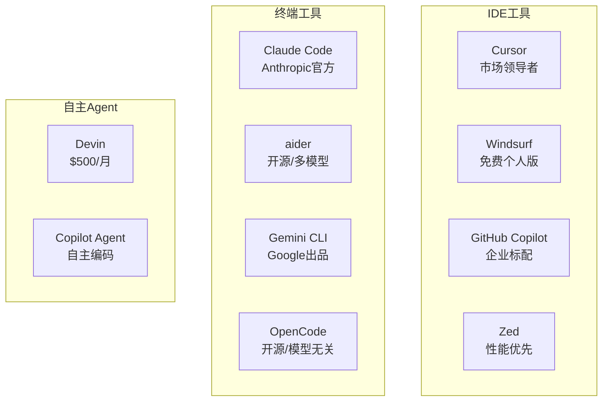
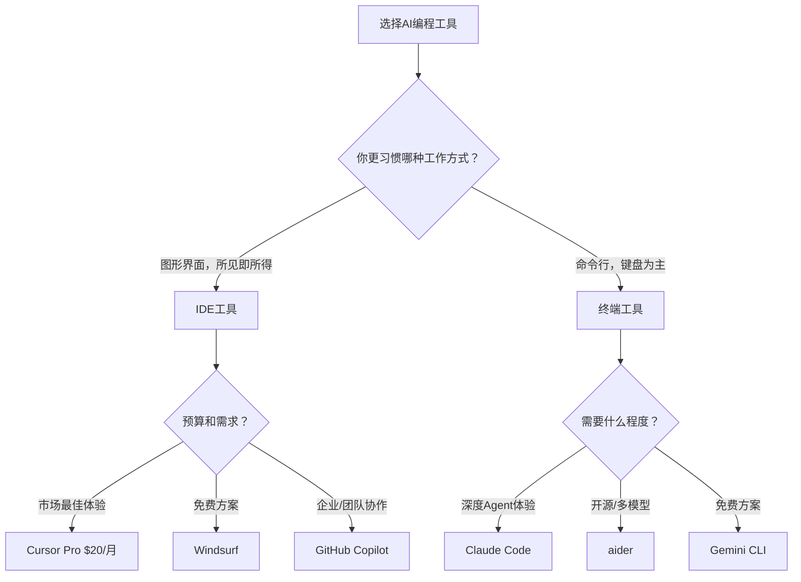

# AI编程工具如何选择

## 本章要点

通过这一章，我希望帮你建立一个清晰的AI编程工具选择框架。我们会从宏观层面比较IDE类工具和终端类工具的差异，也会深入探讨每一类工具内部不同产品的特点。读完之后，你应该能够根据自己的工作习惯和项目需求，做出适合自己的选择。

## 2026年的AI编程工具版图

如果你在2024年看过AI编程工具的介绍，现在再看可能会大吃一惊。短短一两年，这个领域经历了翻天覆地的变化。Cursor从一个小众工具成长为年收入超过5亿美元的市场领导者；Anthropic推出了Claude Code，让终端编程变成了"对话即一切"的体验；GitHub Copilot不再只是一个代码补全插件，而是拥有了自主执行任务的能力。

先来看一张2026年初的市场全景图：

2025年2月24日是一个值得记住的日子。这一天，Anthropic发布了Claude Code的研究预览版。它让AI不再只是在聊天窗口里给你建议，而是能直接读取文件、运行命令、写代码、提交PR。这个看似简单的变化，开启了一个新的时代：**从聊天机器人到代理（Agent）的转变**。

终端不再是"极客"的专属领地。到了2025年底，越来越多非技术背景的人开始使用Claude Code这样的工具构建自己的应用。那个曾经让普通人望而却步的黑色窗口，正在变成最平易近人的编程环境。

## 两大阵营：IDE vs 终端

如果你观察一下当前主流的AI编程工具，会发现它们大致可以分为两大阵营。一类是集成在图形化编辑环境中的**IDE工具**，代表产品是Cursor、Windsurf、GitHub Copilot；另一类是运行在命令行终端里的**CLI工具**，代表产品是Claude Code、aider、Gemini CLI。

这两类工具不仅仅是"界面"不同，它们代表了两种不同的工作哲学和思维模式。理解这种差异，是选择工具的第一步。

### IDE工具：所见即所得的沉浸体验

IDE类工具的核心优势在于**沉浸感**。当你使用Cursor或GitHub Copilot时，AI的能力直接嵌入到你熟悉的编码环境中。你不需要切换窗口，不需要离开代码编辑的上下文，AI的建议就出现在你的光标旁边，像是有一个隐形的伙伴在和你结对编程。

这种体验的好处是流畅。想象一下，你正在写一个复杂的函数，写到一半卡住了。在IDE工具中，你只需要停顿一下，或者写一行注释描述你想要什么，AI就会给出建议。你觉得合适就按Tab接受，不合适就继续自己写。整个过程毫秒级响应，几乎不会打断你的思路。

IDE工具也更适合**视觉化的任务**。当你需要调试前端界面、调整CSS样式、理解复杂的代码结构时，图形界面提供了更直观的支持。你可以在分屏中同时看到代码和运行效果，AI也能"看到"你看到的内容，给出更贴合场景的建议。

但IDE工具也有它的局限。传统的IDE插件通常只能"看到"你当前打开的文件或项目。不过，Cursor和新版的GitHub Copilot Agent正在突破这个限制，它们能理解更大范围的上下文，甚至能自主规划和执行多步骤任务。

### 终端工具：对话即一切的纯粹体验

终端类工具代表了一种更"原生"的工作方式。当你启动Claude Code，你进入的是一个纯对话的环境。这里没有花哨的界面，只有文字。但正是这种简洁，带来了一种独特的体验：**你说的每一句话，AI都在认真听**。

终端工具的核心优势在于**Agent能力**。Claude Code这样的工具从一开始就是为"让AI动手做事"而设计的。它能看到你的目录结构，能读取任意文件，能运行命令，能提交代码。当你让AI帮你"重构一下这个模块"，它不只是给出建议，而是直接动手改，改完还会运行测试确保没破坏东西。

这种工作方式的本质区别在于：**从"AI建议，人来执行"变成了"AI执行，人来审核"**。你不再需要把AI生成的代码复制粘贴到编辑器里，不再需要在终端和编辑器之间来回切换。AI就是你的双手，你只需要告诉它做什么，然后检查结果是否满意。

这种工作方式更适合那些喜欢**命令行环境**的开发者。如果你习惯用git命令而不是GUI，习惯用终端编辑器如Vim或Neovim，终端工具会让你感到更自在。有趣的是，到了2025年底，越来越多的非程序员也开始尝试这些工具——因为当你习惯了自然语言交互，终端的"门槛"反而变得不那么高了。

当然，终端工具的学习曲线更陡。你需要习惯用文字描述一切，而不是看到什么就直接点。遇到UI相关的问题时，终端工具也无法"看见"你的界面，需要你提供更多描述。

### 如何选择？

如果你还是不确定该从哪一边入手，可以参考下面这个简单的决策指南：

这个指南只是一个起点。实际上，最好的方式是两种工具都尝试一下，感受它们带来的不同体验。很多开发者在实际工作中会同时使用两类工具：用IDE工具处理日常的编码任务，用终端工具处理需要AI深度参与的复杂重构或新功能开发。

## IDE工具对比：Cursor vs GitHub Copilot vs Windsurf

在IDE阵营中，Cursor目前是市场领导者，但GitHub Copilot和Windsurf也各有优势。让我们详细比较一下它们。

### Cursor：重新定义AI编辑器

Cursor不是一个"VS Code加AI插件"，它是从零开始为AI编程设计的编辑器。这个定位决定了它在2026年拥有了无与伦比的优势。

**2025年的重大升级**让Cursor变得更加成熟。2.0版本推出了自家的**Composer模型**——一个专门为编码优化的超快速模型，以及全新的**Agent界面**。现在，Cursor不再只是"VS Code加AI"，而更像是一个"Agent工作台恰好也是个编辑器"。

让我们看看Cursor在2026年的核心能力：

**Tab补全（Supermaven驱动）**是Cursor的王牌之一。它不只是补全代码，还能预测你下一步想编辑哪里。你刚改了一个函数名，它会建议你更新所有调用处；你添加了一个新字段，它会建议你在哪些地方使用它。这种"预判"能力让编码效率大幅提升。

**Composer模式**让多文件编辑变得极其自然。你只需要描述需求，比如"添加一个用户登录功能"，Cursor会自动确定需要修改哪些文件，逐个展示diff给你审核。你不需要手动切换文件，不需要关心文件之间的依赖关系。

**Background Agents**是2026年的新功能。你可以把一些任务交给后台Agent处理——比如"重构这个模块并更新所有测试"——然后继续做其他事情。Agent会在后台工作，完成后通知你审核结果。

**Rules和Hooks**让AI的行为变得可预测。你可以定义规则告诉AI"用这个项目的代码风格"、"调用API前先检查权限"，AI每次都会遵守。你可以设置钩子来自动执行某些操作，比如"每次创建新文件时自动添加版权声明"。

### GitHub Copilot：从补全到Agent

GitHub Copilot在2025年也经历了重大升级。它不再只是一个代码补全工具，而是拥有了**Copilot Coding Agent**——一个能自主完成任务的AI代理。

**Copilot Coding Agent**的工作方式是这样的：你给它分配一个GitHub Issue，它会自动分析需求、编写代码、运行测试、创建Pull Request。你只需要审核最终的PR，决定是否合并。这大大减少了你在Issue和代码之间来回切换的摩擦。

**Copilot CLI**将Copilot的能力带到了终端。你现在可以在命令行中让AI帮你解释命令、调试脚本、或者执行复杂的DevOps任务。这模糊了IDE工具和终端工具的界限。

**Copilot Spaces**是一个新概念：你可以创建一个"空间"，把相关的代码、文档、规格说明都放进去，让AI的回复更有上下文针对性。这对于大型项目特别有用。

Copilot的优势依然是**熟悉感**。如果你已经习惯用VS Code写代码，添加Copilot不需要你适应任何新环境。你的快捷键、主题、插件配置，一切都和以前一样。

### Windsurf：免费的有力竞争者

Windsurf是2026年的一匹黑马。它由Codeium团队开发，对个人用户**完全免费**，却提供了接近Cursor的功能。

Windsurf的核心优势在于**不限量的使用**。当Cursor在2025年8月修改积分系统引发争议时，Windsurf乘势而起，成为那些预算有限但想要体验AI编程的开发者的首选。

它的**Cascades功能**类似于Cursor的Composer，能让你在一个流程中处理多个文件的修改。它也支持项目级别的上下文理解，能自动索引整个代码库。

### 功能对比一览

| 特性 | Cursor | GitHub Copilot | Windsurf |
|-----|--------|----------------|----------|
| 形态 | 独立编辑器 | IDE插件 | 独立编辑器 |
| 多文件编辑 | ✅ Composer | ✅ Agent | ✅ Cascades |
| Agent能力 | ✅ Background Agents | ✅ Coding Agent | ⚠️ 有限 |
| 项目级上下文 | ✅ 自动索引 | ✅ Spaces | ✅ 自动索引 |
| 代码补全 | ✅ Supermaven | ✅ 行级补全 | ✅ 原生 |
| 个人价格 | $20/月 Pro | $10/月 | 免费 |

### 适合谁？

**Cursor适合你，如果你：**
- 愿意为了最好的AI体验付费
- 需要AI深度参与复杂任务
- 想要最成熟的Agent工作流

**GitHub Copilot适合你，如果你：**
- 已经用VS Code或有企业订阅
- 主要需要代码补全和简单问答
- 与GitHub深度集成很重要

**Windsurf适合你，如果你：**
- 预算有限但想体验AI编程
- 不想适应新的编辑器
- 需要一个免费但功能强大的选择

## 终端工具对比：Claude Code vs aider vs Gemini CLI

在终端阵营中，Claude Code在2025年引爆了整个行业，aider继续保持开源社区的热度，Google也推出了Gemini CLI加入竞争。

### Claude Code：Agent时代的先驱

2025年2月24日，Anthropic发布了Claude Code的研究预览版。这个看似简单的终端工具，改变了人们对AI编程的认知。

**Claude Code的本质创新**在于它让AI不再只是一个"聊天机器人"，而是一个能真正"动手做事"的代理。你告诉它"帮我添加用户登录功能"，它会：

1. 先读取项目中相关的文件，理解现有架构
2. 规划需要创建或修改哪些文件
3. 编写代码，遵循你项目的风格
4. 运行测试，发现错误就修复
5. 提交代码或创建PR

整个过程你在旁边看着，随时可以介入干预。AI不是在替你做决定，而是在替你执行决定。

**到2026年初**，Claude Code已经发展成为一个**多代理开发平台**。2.0.70版本带来了显著的改进：内存使用优化了3倍、输入处理更加稳定、diff视图会随终端大小自动调整。更重要的是，它现在支持更多的MCP服务器，能访问更广泛的外部工具和数据源。

**Plan Mode**是Claude Code的一个关键特性。面对复杂需求时，你可以让它先制定计划，你审核满意后再执行。这避免了AI"想一出是一出"导致的返工。

**与GitHub和GitLab的深度集成**让工作流更加顺畅。Claude Code能直接读取Issue、创建分支、提交PR——所有这些都在终端对话中完成，不需要你在网页和编辑器之间跳来跳去。

### aider：开源自由派

aider在开源社区积累了几年的口碑，它最大的优势是**模型无关性**。

当你使用Claude Code时，你被锁定在Anthropic的模型上。但aider允许你使用任何兼容API的模型——Claude、GPT-4、DeepSeek、甚至是本地的Ollama。这给了你极大的灵活性：

- 想要最好的效果？用Claude Opus或GPT-4
- 预算有限？用DeepSeek或o3-mini
- 隐私要求高？用本地部署的Ollama

** Git原生集成**是aider的另一大特色。每次代码修改，aider都会生成一个清晰的commit。如果你不喜欢某个改动，只需要`git revert`就能撤销。这种"一切皆可回滚"的安全感，让很多开发者感到踏实。

**透明的修改流程**让一切都不神秘。你需要显式地用`/add`命令把文件加入会话，清楚地知道AI能看到哪些内容。每次修改都展示diff，你可以逐个确认或批量接受。

### Gemini CLI：Google的免费方案

2025年6月，Google推出了Gemini CLI，基于Gemini 2.5 Pro模型。它最大的吸引力在于**慷慨的免费额度**。

对于个人开发者，Gemini CLI提供了比Claude Code更友好的入门门槛。你不需要每月支付订阅费，就可以在终端里体验AI编程。

Gemini CLI也采用了Agent架构，能读取文件、运行命令、执行git操作。虽然整体成熟度还不如Claude Code，但它发展迅速，是一个值得关注的竞争者。

### 工作方式对比

| 特性 | Claude Code | aider | Gemini CLI |
|-----|-------------|-------|------------|
| 模型支持 | Claude专属 | 任意模型 | Gemini专属 |
| 价格 | $17/月 Pro | 自带API | 免费额度 |
| Agent能力 | ✅ 深度集成 | ⚠️ 辅助型 | ✅ 支持 |
| Git集成 | ✅ 自动commit | ✅ 自动commit | ✅ 支持 |
| 开源程度 | ❌ 闭源 | ✅ 完全开源 | ❌ 闭源 |

### 适合谁？

**Claude Code适合你，如果你：**
- 想要最成熟的Agent编程体验
- 愿意订阅Claude Pro/Max
- 需要处理复杂的开发任务

**aider适合你，如果你：**
- 希望完全掌控使用哪个模型
- 重视开源和社区驱动
- 有特定的隐私或成本考量

**Gemini CLI适合你，如果你：**
- 想要免费体验终端AI编程
- 已经在使用Google生态
- 预算有限但有基本的Agent需求

## 我的建议

聊了这么多工具，最后我想给你一个务实的建议：**不要在工具选择上纠结太久，先选一个上手用起来**。

工具的价值只有在实际使用中才能体现。你花一周时间研究哪个工具"更好"，不如花一天时间把其中一个用熟。等你真正用了一段时间，你会发现自己对工具有了更清晰的要求，那时再调整选择也为时不晚。

如果你实在需要一个具体的推荐，我会说：

**2026年初的推荐选择：**

| 使用场景 | 推荐工具 | 理由 |
|---------|---------|------|
| 日常开发，预算充足 | Cursor Pro | 最佳的IDE+AI整合体验 |
| 免费体验AI编程 | Windsurf + Gemini CLI | 两端都免费，功能够用 |
| 深度Agent任务 | Claude Code | 目前最成熟的终端Agent |
| 开源/自托管需求 | aider + Ollama | 完全本地，模型自由 |
| 企业/团队协作 | GitHub Copilot | 与GitHub生态深度集成 |

最重要的是，记住工具是为你服务的。如果一个工具让你感觉别扭、效率反而降低了，那就果断换一个。没有最好的工具，只有最适合你的工具。

## 小结

这一章，我们从宏观到微观，梳理了2026年AI编程工具的选择图谱。

首先，我们看到AI编程工具市场在过去一年经历了剧烈变化。Cursor成长为市场领导者，Claude Code开创了终端Agent的新范式，GitHub Copilot从一个补全工具进化为能自主完成任务的代理。整个行业从"AI帮你想代码"进化到了"AI帮你写代码、跑测试、提PR"。

然后，我们比较了IDE阵营的主要玩家。Cursor以$20/月提供最佳的综合体验；GitHub Copilot以$10/月成为企业用户的稳妥选择；Windsurf提供免费但功能强大的替代方案。三者各有侧重，选择取决于你的预算和具体需求。

接着，我们比较了终端阵营的主要选择。Claude Code是Agent编程的标杆；aider以其开源和模型无关性吸引自由派用户；Gemini CLI提供了免费入场券。终端不再是极客专属，正在成为最平易近人的AI编程入口。

最后，我的建议是：不要在选择上纠结太久，先用起来再说。工具的价值在于实际使用中发现，而不是比较得出。

在接下来的章节中，我们将分别深入探讨Cursor和Claude Code的具体使用方法，让你掌握这两类工具的精髓。

## 练习

在进入下一章之前，我想请你做一些实践：

**体验题**：如果你一直用IDE工具，试着安装Claude Code或Gemini CLI，完成一个小任务。感受一下终端工具的工作方式有什么不同？同样，如果你一直是终端用户，试着用一用Cursor或Windsurf，看看图形界面带来的体验差异。

**对比题**：选同一个任务（比如"写一个计算器函数并添加测试"），分别用两类工具完成。记录下每种方式的操作步骤、用时、以及你的感受。哪个更顺手？为什么？

**决策题**：假设你现在要开始一个新项目：一个包含前后端的个人博客系统。你会选择哪个工具作为主要开发伙伴？为什么？考虑因素包括：你的技术背景、项目周期、预算、以及你希望在AI身上获得什么样的帮助。把你的选择和理由写下来——过几个月再回来看看，你的想法会有什么变化吗？