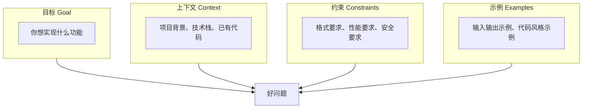

# 如何描述你的编程需求

## 本章要点

在第一章的 `第一次让AI写代码` 中，我们已经体验过第一次让 AI 写代码的完整流程。但你可能已经发现：有时候 AI 给出的代码让你一拍大腿"对！这就是我要的！"，有时候却让你眉头一皱"这……跟我想的好像不太一样？"

这一章，我想帮你解决的核心问题就是：**怎么向 AI 描述你的编程需求，才能让它准确理解你的意图**。

读完这一章后，你将获得三样东西：

- 一套清晰的提问框架，知道该怎么组织你的需求描述
- 识别和避免常见错误的能力，少踩坑、少浪费时间
- 建立与 AI 高效协作的直觉，像和一个真正的同事沟通那样自然

## 为什么"怎么说"比"说什么"更重要

让我先讲一个真实的故事。

2025 年初，有一个开发者在论坛上分享了他的经历。他想让 AI 帮他写一个"用户登录功能"。他的描述是这样的：

```
帮我写一个用户登录功能
```

AI 给了他一段代码——用 Python 写的、基于 Flask 框架、用户名和密码存在数据库里。他看完之后很失望："这不是我想要的，我想要的是 React 前端、用 API 调用后端、而且密码要加密存储。"

于是他重新写了一段描述：

```
帮我写一个用户登录功能，要求如下：
1. 前端用 React，后端用 Node.js Express
2. 用户提交表单后，前端发送 POST 请求到 /api/login
3. 后端验证用户名密码，密码用 bcrypt 加密存储
4. 登录成功后返回 JWT token
5. 登录失败返回错误信息，区分"用户不存在"和"密码错误"
```

这一次，AI 给他的代码几乎可以直接用。

这个故事的启示是什么？**AI 不是读心术，它只能理解你告诉它的东西。**

很多人第一次使用 AI 编程工具时，会有一个误区：认为 AI 应该"懂得"自己的意图。毕竟，人类之间交流时，很多话是不需要说透的——你说"帮我倒杯水"，对方不会真的只倒一杯水放在那里，而是会理解你可能渴了、可能需要放在手边、可能需要适中的温度。

但 AI 没有这种"察言观色"的能力。它没有你的生活经验，不了解你的项目背景，不知道你的代码风格偏好。它唯一能依赖的，就是你输入的那段文字。

所以，**描述需求的能力，本质上是把"模糊意图"转化为"精确指令"的能力**。这种能力，是 AI 时代程序员的核心技能之一。

想象一下，如果你有一个非常聪明、非常勤奋、但完全不了解你项目的实习生。你给他的每一个指令，都需要足够清晰、足够具体，他才能给出你想要的结果。AI 就是这样一个"超级实习生"——它能力很强，但它需要你告诉它具体要做什么。

## 一个好问题的四个要素

经过大量的实践和总结，我发现：一段好的需求描述，通常包含四个核心要素。我把它们称为**"需求描述四要素"**。



### 要素一：目标（Goal）—— 你想实现什么功能

这是最基本、也最重要的要素。很多需求描述的问题，根源在于目标本身就不清晰。

**什么是清晰的目标？**

清晰的目标描述应该能让 AI 回答这个问题："完成任务后，应该是什么样子？"

让我们对比两个例子：

**模糊的目标：**
```
帮我优化一下这个函数
```

这个描述的问题在哪里？"优化"是一个模糊的词——是优化性能？优化可读性？优化代码长度？AI 不知道，它只能猜测。

**清晰的目标：**
```
这个函数运行太慢了，处理 10 万条数据需要 30 秒。
请优化它的性能，目标是在 5 秒内完成。
```

现在目标很明确：提升性能，有具体的量化指标（从 30 秒降到 5 秒）。AI 可以基于这个目标，分析瓶颈在哪里、用什么算法更合适。

**再来看一个例子：**

模糊描述：
```
这段代码有问题，帮我修一下
```

清晰描述：
```
这个函数在处理空列表时会抛出 IndexError。
请修复这个 bug，让它在输入空列表时返回 0。
```

你看，清晰的目标描述包含两个关键信息：
1. **问题是什么**（空列表时抛异常）
2. **期望行为是什么**（返回 0）

**怎么写好目标？**

这里有几个实用技巧：

**技巧一：用"当……时，应该……"的句式**

这个句式能帮你把目标和场景绑定起来：

```
当用户输入的密码长度小于 8 位时，应该返回"密码长度不足"的错误提示
当文件不存在时，应该返回 None 而不是抛出异常
当网络请求超时，应该重试 3 次后再报错
```

**技巧二：量化你的目标**

如果目标可以量化，尽量用数字说话：

```
不好：这个函数太慢了，优化一下
好：这个函数处理 1000 条数据需要 2 秒，希望能优化到 0.5 秒以内

不好：代码可读性太差
好：每个函数不超过 50 行，每个函数必须有 docstring

不好：内存占用太高
好：处理 1GB 文件时，内存占用不要超过 2GB
```

**技巧三：区分"是什么"和"怎么做"**

描述目标时，聚焦在"要实现什么功能"，而不是"应该用什么方法实现"。给 AI 留出发挥空间：

```
不好：用一个 for 循环遍历这个列表，然后用 if 判断……
好：过滤出所有大于 10 的数字，返回新列表
```

当然，如果你确实有技术选型的要求（比如必须用某种方法），那就是另外一回事了。

### 要素二：上下文（Context）—— 让 AI 理解你的场景

AI 不知道你的项目是什么样子，除非你告诉它。

**上下文为什么重要？**

想象一下这个场景：你问"怎么读取一个文件"。这个问题有标准答案吗？

- 如果你在写 Python 脚本，答案是 `open()` 函数
- 如果你在前端浏览器环境，答案是 `FileReader` API
- 如果你在 Node.js 环境，答案是 `fs.readFile()`
- 如果你在读取大文件，可能需要流式读取
- 如果你在分布式系统，可能需要考虑文件在哪里

没有上下文，AI 只能猜。猜对了是运气，猜错了是常态。

**上下文包含什么？**

通常来说，以下信息都属于上下文：

**技术栈信息：**
```
我正在用 Python 3.11 开发一个 Web 应用
前端是 React 18，后端是 FastAPI
数据库用的是 PostgreSQL 15
```

**项目结构信息：**
```
这是一个数据分析项目，主要功能是读取 Excel 文件并生成图表
核心代码在 src/analysis/ 目录下
配置信息在 config.yaml 中
```

**已有代码信息：**
```
我已经有一个处理日期的函数了（见下面代码）
现在需要写一个类似的函数处理时间
请保持代码风格一致
```

**业务场景信息：**
```
这是一个电商网站的用户系统
密码需要符合金融级安全标准
用户量级是百万级，日活 10 万+
```

**让我们看一个完整的例子：**

没有上下文的描述：
```
帮我写一个函数，验证邮箱格式
```

有上下文的描述：
```
我正在开发一个企业内部管理系统（Python + FastAPI）。
用户注册时需要验证邮箱格式。

要求：
1. 检查基本格式（xxx@xxx.xxx）
2. 只允许公司域名（@company.com）
3. 返回布尔值和错误信息

请写一个函数 validate_company_email(email: str) -> tuple[bool, str]
```

第二段描述让 AI 理解了：
- 技术栈（Python + FastAPI）
- 使用场景（企业系统的用户注册）
- 特殊要求（只允许公司域名）
- 函数签名（输入输出类型）

AI 基于这些信息，可以给出更贴合你需求的代码。

**怎么提供上下文？**

以下是几种常见的方式：

**方式一：直接在问题中说明**

最简单直接的方式，在问题开头用一两句话介绍背景：

```
我正在做一个课程表小程序，用 Python 写命令行版本。
需要实现一个功能：……
```

**方式二：附上相关代码**

如果你的问题和现有代码有关，直接把代码贴出来：

```
我有下面这个类，用于处理用户数据：

class User:
    def __init__(self, name, email):
        self.name = name
        self.email = email

    def to_dict(self):
        return {"name": self.name, "email": self.email}

现在需要添加一个方法，把 dict 转换回 User 对象。
请保持代码风格一致。
```

**方式三：利用工具的上下文功能**

现代 AI 编程工具（如 Cursor、Claude Code）都有上下文引用功能：

- 在 Cursor 中，可以用 `@文件名` 引用特定文件
- 用 `@Codebase` 让 AI 搜索整个代码库
- 用 `@Docs` 引用官方文档

这些功能让 AI 能"看到"你的项目结构，你不需要把所有背景信息都写出来。

### 要素三：约束（Constraints）—— 划定边界

约束是需求的"边界条件"，告诉 AI 什么是可以的、什么是不可以的。

**为什么需要约束？**

没有约束的需求，就像一个没有围栏的花园——AI 可以"自由发挥"，但结果可能不是你想要的。

举个例子，你要写一个函数计算两个数的和：

没有约束：
```
写一个函数，计算两个数的和
```

AI 可能给出：
```python
def add(a, b):
    return a + b
```

看起来没问题。但如果你后续发现：
- 没有类型检查，传入字符串也能运行（但结果可能不是你想要的）
- 没有处理浮点数精度问题
- 没有处理 overflow 的情况

如果你的场景需要这些考虑，就应该提前说：

有约束：
```
写一个函数，计算两个整数的和

约束：
1. 只接受整数类型，传入其他类型抛出 TypeError
2. 不需要处理 overflow（Python 自动处理大整数）
3. 添加类型注解和 docstring
```

**常见的约束类型：**

**技术约束：**
```
只能用 Python 标准库，不能用第三方库
必须用 async/await 异步写法
必须兼容 Python 3.8+
```

**格式约束：**
```
函数必须有完整的 docstring，包括参数说明和返回值说明
所有变量名用 snake_case 命名
每行代码不超过 80 个字符
```

**性能约束：**
```
时间复杂度必须是 O(n) 或更好
空间复杂度必须是 O(1)
必须能处理 100 万条数据
```

**安全约束：**
```
密码必须用 bcrypt 加密，不能明文存储
SQL 查询必须用参数化，防止注入
用户输入必须验证和转义
```

**业务约束：**
```
错误信息必须用中文，不能用英文
日志必须包含用户 ID 和时间戳
必须符合公司的代码规范（附规范文档）
```

**约束的度：不要过度约束**

这里有一个需要平衡的地方：约束太少，AI 可能给出不符合你需求的答案；约束太多，可能把 AI 的手脚绑得太死，反而得不到最优解。

怎么判断？问自己一个问题：**这个约束是"必要的"还是"我习惯的"？**

```
必要约束：必须用 PostgreSQL（因为公司数据库就是这个）
习惯约束：变量名必须用单字母（这是你的个人偏好，但不一定最好）

必要约束：密码必须加密存储（安全要求）
习惯约束：必须先检查参数类型再处理（可能 AI 有更好的方式）
```

对于必要约束，一定要说清楚；对于习惯约束，可以考虑是否真的必要。

### 要素四：示例（Examples）—— 用例子消除歧义

有时候，文字描述再清晰，也可能有歧义。这个时候，给一个例子胜过千言万语。

**示例的力量**

想象你在教一个学生做题。你告诉他："找出所有的偶数"。他可能还是不确定：0 算不算？负数算不算？小数呢？

但如果你给一个例子：
```
输入：[1, 2, 3, 4, 5, 6]
输出：[2, 4, 6]
```

他立刻就能明白了。

AI 也是一样的道理。示例能帮助 AI：
1. **理解你的输入输出格式**
2. **理解边界情况怎么处理**
3. **理解你的代码风格偏好**

**怎么用示例？**

**方式一：输入输出示例**

这是最常见的方式，特别适合纯函数：

```
写一个函数，把字符串转换成"驼峰命名"格式。

示例：
"hello_world" -> "helloWorld"
"hello-world-test" -> "helloWorldTest"
"HELLO_WORLD" -> "helloWorld"
"_hello_world_" -> "helloWorld"
```

这个示例传达了多个信息：
- 下划线和横杠都作为分隔符
- 第一个单词保持小写开头
- 后续单词首字母大写
- 多余的分隔符被忽略

光看文字描述可能需要很多话，但几个示例一目了然。

**方式二：代码风格示例**

如果你有特定的代码风格偏好，可以给一个示例：

```
我需要写一组类似的函数，参考下面这个的风格：

def get_user_by_id(user_id: int) -> Optional[Dict]:
    """根据 ID 获取用户信息"""
    try:
        return db.query("SELECT * FROM users WHERE id = ?", user_id)
    except DatabaseError as e:
        logger.error(f"获取用户失败：{e}")
        return None

现在需要写一个 get_user_by_email 函数，请保持：
- 同样的 docstring 格式
- 同样的错误处理方式
- 同样的日志格式
```

**方式三：边界情况示例**

有时候，核心逻辑很简单，但边界情况容易出错。用示例明确指出：

```
写一个除法函数，处理各种边界情况：

示例：
divide(10, 2) -> 5
divide(7, 3) -> 2.333...  # 浮点数结果
divide(0, 5) -> 0
divide(5, 0) -> 抛出 ZeroDivisionError，错误信息为"除数不能为 0"
divide(-10, 2) -> -5
```

## 完整的提问模板

理解了四要素之后，我来给你几个可以直接套用的模板。

### 模板一：写新代码

```
# 目标
我想实现 [什么功能]，用于 [什么场景]

# 上下文
- 技术栈：[语言/框架版本]
- 项目类型：[Web 应用/脚本/库/...]
- 相关代码：[附上或@引用]

# 约束
- 技术要求：[必须用/不能用...]
- 格式要求：[命名规范/docstring/...]
- 性能要求：[时间/空间复杂度...]

# 示例
期望的输入输出：
输入：[...]
输出：[...]
```

**实际使用示例：**

```
# 目标
我想实现一个函数，批量验证邮箱格式，用于用户导入功能

# 上下文
- 技术栈：Python 3.11
- 项目类型：企业内部管理系统
- 已有验证单个邮箱的函数（见下面）

def validate_email(email: str) -> bool:
    """验证单个邮箱格式"""
    pattern = r'^[a-zA-Z0-9._%+-]+@[a-zA-Z0-9.-]+\.[a-zA-Z]{2,}$'
    return bool(re.match(pattern, email))

# 约束
- 处理 10 万条数据应该在 10 秒内完成
- 需要返回详细错误信息（哪些邮箱无效）
- 保持与现有函数一致的命名风格

# 示例
期望的输入输出：
输入：["a@b.com", "invalid", "c@d.org"]
输出：{"valid": ["a@b.com", "c@d.org"], "invalid": ["invalid"]}
```

### 模板二：修改现有代码

```
# 问题
[哪段代码] 在 [什么情况下] 出现 [什么问题]

# 当前代码
[附上代码或@文件]

# 期望行为
当前：[现在是什么表现]
期望：[应该是什么表现]

# 约束
- 不能改变 [哪些现有功能]
- 必须保持 [向后兼容/接口不变/...]
```

**实际使用示例：**

```
# 问题
下面的 parse_date 函数在处理 "2024-02-30" 这样的非法日期时没有报错，
而是自动转换成了 "2024-03-01"。但我需要它抛出错误。

# 当前代码
def parse_date(date_str: str) -> datetime:
    return datetime.strptime(date_str, "%Y-%m-%d")

# 期望行为
当前：parse_date("2024-02-30") 返回 datetime(2024, 3, 1)
期望：parse_date("2024-02-30") 抛出 ValueError，错误信息说明日期不合法

# 约束
- 保持函数签名不变
- 错误信息要清晰说明问题（哪个日期、为什么非法）
```

### 模板三：解释代码

```
# 目标
我想理解 [哪段代码] 的工作原理

# 上下文
- 这段代码来自 [哪里：项目/库/教程]
- 我已经知道 [你已经理解的部分]
- 我不理解 [具体哪里不明白]

# 代码
[附上代码或@文件]

# 具体问题
1. [问题一]
2. [问题二]
```

**实际使用示例：**

```
# 目标
我想理解这个装饰器的工作原理

# 上下文
- 这段代码来自我们项目的认证模块
- 我知道装饰器的基本语法
- 我不理解 @wraps 的作用，以及这个装饰器怎么处理权限检查的

# 代码
from functools import wraps

def require_permission(permission):
    def decorator(func):
        @wraps(func)
        def wrapper(user, *args, **kwargs):
            if not user.has_permission(permission):
                raise PermissionError(f"需要 {permission} 权限")
            return func(user, *args, **kwargs)
        return wrapper
    return decorator

# 具体问题
1. @wraps(func) 的作用是什么？没有它会怎样？
2. permission 参数是如何传递和保存的？
3. 这个装饰器能用于类方法吗？
```

## 常见错误与反模式

学完了正确的做法，我们来看看常见的"错误示范"。了解这些陷阱，能帮你少走弯路。

### 错误一：假设 AI 知道你的项目

**错误示例：**
```
帮我修复这个 bug（直接贴了一段代码）
```

**问题在哪里？**

AI 不知道：
- 这段代码属于哪个项目
- 项目用的是什么技术栈
- 相关的依赖和配置是什么
- 这段代码的"正常行为"应该是什么

**正确做法：**

提供最小必要上下文：
```
这是一个 Flask 应用的错误处理中间件。
问题是：当数据库连接超时时，应该返回 503 状态码，但实际返回了 500。

[附上代码]
```

### 错误二：需求描述太模糊

**错误示例：**
```
这个代码不太对，帮我看看
```

**问题在哪里？**

"不太对"是一个主观感受，不是客观问题。AI 不知道：
- 是运行报错？
- 是结果不符合预期？
- 是代码风格不喜欢？
- 还是有其他问题？

**正确做法：**

具体描述问题：
```
这个函数在输入负数时返回了负的结果，但我期望它返回绝对值。
输入：factorial(-5)
期望：抛出 ValueError，说明"阶乘不支持负数"
实际：返回 -120
```

### 错误三：一次性问太多问题

**错误示例：**
```
帮我看看这个项目：
1. 这个函数有没有 bug？
2. 性能能不能优化？
3. 代码风格好不好？
4. 有没有更好的写法？
5. 怎么添加单元测试？
6. 文档怎么写？
```

**问题在哪里？**

每个问题都需要不同的思考角度：
- 找 bug 需要逐行分析逻辑
- 性能优化需要分析算法复杂度
- 代码风格需要对照规范
- ...

一次性问所有问题，AI 只能每个都浅尝辄止，给不出深度建议。

**正确做法：**

拆分问题，逐个击破：
```
第一轮：
帮我检查这个函数有没有 bug，特别是边界情况。

[等 AI 回答并修复 bug 后]

第二轮：
现在代码正确了，帮我分析一下性能瓶颈在哪里。
```

### 错误四：只说"怎么做"，不说"为什么"

**错误示例：**
```
把这个函数的 for 循环改成 while 循环
```

**问题在哪里？**

AI 可以照做，但它不知道：
- 你为什么想改？（是为了性能？还是代码规范？）
- 改了之后需要保持什么？（功能不变？还是其他要求？）
- 有没有更好的方案？（也许根本不需要改循环方式）

**正确做法：**

说明意图：
```
这个 for 循环在处理大列表时性能很差。
我想优化它的性能，初步想法是改成 while 循环提前退出。
你有更好的建议吗？
```

这样 AI 可以：
1. 分析是否真的是循环方式的问题
2. 如果不是，给出更有效的优化建议
3. 如果确实是，给出正确的改写方式

### 错误五：不提供错误信息

**错误示例：**
```
运行报错了，帮我修一下
[附上代码]
```

**问题在哪里？**

错误信息是诊断问题的关键线索。没有错误信息，AI 只能猜：
- 是语法错误？
- 是运行时错误？
- 是什么类型的异常？
- 错误发生在哪一行？

**正确做法：**

完整提供错误信息：
```
运行时报错：

Traceback (most recent call last):
  File "main.py", line 15, in <module>
    result = calculate(data)
  File "main.py", line 8, in calculate
    return sum(values) / len(values)
ZeroDivisionError: division by zero

[附上代码]
```

### 错误六：不接受 AI 的追问

这是一个双向的问题。有时候，AI 会反过来问你问题，要求更多信息。

**错误做法：**
```
（AI：请问这个函数的输入数据格式是什么？）
（用户：就是普通的数据啊，你直接写就行了）
```

**问题在哪里？**

AI 追问，说明它意识到信息不足。强行让它"猜"，结果往往不理想。

**正确做法：**

耐心回答追问的问题。如果 AI 问到了你没考虑到的细节，这其实是一个好信号——说明你在思考需求时可能有遗漏。

## 迭代式提问：把提问当成对话

很多人有一个误区：认为应该"一次就把问题问完美"。如果 AI 给出的答案不满意，就觉得自己提问方式有问题。

但我想告诉你：**好的需求描述，往往是在对话中逐步完善的。**

### 迭代的力量

让我用一个实际例子说明：

**第一轮：**
```
写一个函数，计算列表的平均值
```

AI 给出了基本版本。你运行后发现：空列表会报错。

**第二轮：**
```
刚才的函数在空列表时会报错。请修改为返回 0。
```

AI 修复了。你继续测试发现：如果列表里有非数字会怎么样？

**第三轮：**
```
如果列表里有非数字元素，应该跳过还是报错？
```

AI：这取决于你的需求。如果你想严格验证，可以报错；如果想容错处理，可以跳过。

**第四轮：**
```
跳过非数字元素，但如果所有元素都被跳过了，返回 0。
另外，添加类型注解和 docstring。
```

现在你得到了一个完善的版本。

### 为什么迭代是好的？

**原因一：你不需要一开始就想清楚所有细节**

现实中的编程工作就是这样：你有一个大致想法，开始实现，然后逐步发现更多细节和边界情况。迭代式提问符合这个自然过程。

**原因二：AI 的回答能帮你发现问题**

有时候，你看到 AI 的代码后才会意识到："哦，原来这里可能有空列表的情况"、"原来这里可能有类型问题"。AI 的回答是一个"思考触发器"。

**原因三：迭代让你保持控制**

每一轮对话，你都在审核 AI 的工作，决定下一步方向。这符合我们的核心原则：**你主导 AI，不是 AI 主导你。**

### 怎么进行迭代？

**模式一：逐步添加需求**
```
第一轮：基本功能
第二轮：边界情况处理
第三轮：性能和优化
第四轮：代码质量（注释、风格）
```

**模式二：问题驱动**
```
第一轮：实现功能
第二轮：修复发现的 bug
第三轮：处理新的边界情况
第四轮：完善错误处理
```

**模式三：探索式**
```
第一轮：AI 给出方案
第二轮：你提出疑问
第三轮：AI 调整方案
第四轮：你确认方案
```

## 特殊场景的提问技巧

不同的编程任务，有不同的提问要点。让我分享几个常见场景的技巧。

### 场景一：从零开始写新功能

**关键：先描述整体，再细化细节**

```
第一轮（整体）：
我想在我的 Flask 应用中添加用户认证功能。
请帮我设计整体方案，包括：
- 需要哪些 API 端点
- 数据库表结构
- 认证流程

第二轮（细化）：
好的，方案我理解了。现在开始实现登录 API。
要求：
- POST /api/login
- 接收 username 和 password
- 验证成功后返回 JWT token
- 验证失败返回 401 和错误信息

第三轮（代码）：
请写出具体的代码实现。
注意：密码用 bcrypt 加密，JWT 密钥从环境变量读取。
```

### 场景二：理解别人的代码

**关键：分层提问，从宏观到微观**

```
第一轮（宏观）：
这段代码整体是做什么的？用一两句话概括。

第二轮（结构）：
代码分成了哪几个主要部分？每部分的作用是什么？

第三轮（细节）：
这个函数的具体逻辑是什么？能一步步解释吗？

第四轮（深入）：
这里为什么用这种方法而不用那种？有什么考虑吗？
```

### 场景三：调试 bug

**关键：提供完整的"症状"信息**

```
问题描述：
- 什么操作触发的？（用户点击按钮/调用 API/定时任务...）
- 期望结果是什么？
- 实际结果是什么？
- 是必现还是偶发？

环境信息：
- 操作系统、语言版本、相关依赖版本

错误信息：
- 完整的错误堆栈
- 相关日志

复现步骤：
1. ...
2. ...
3. 报错
```

### 场景四：代码重构

**关键：明确重构目标和不变的部分**

```
我想重构这个模块，目标：
1. 提高代码可读性
2. 减少重复代码
3. 便于后续扩展

约束：
- 不能改变对外接口（函数签名、返回值）
- 必须保持向后兼容
- 重构后测试必须全部通过

请先分析代码，给出重构方案，不要直接改代码。
```

## 高级技巧：让 AI 更懂你

学完了基础，我来分享几个进阶技巧，让你的提问更上一层楼。

### 技巧一：建立"上下文记忆"

很多 AI 工具支持长对话。你可以利用这一点，在对话开始时建立"上下文"，后续对话就不用重复了。

**示例：**
```
在开始之前，我先介绍一下我的项目背景，后面的对话请基于这些上下文：

1. 技术栈：Python 3.11 + FastAPI + PostgreSQL
2. 项目类型：企业内部管理系统
3. 代码规范：
   - 所有函数必须有 docstring
   - 使用类型注解
   - 遵循 PEP 8
4. 特殊要求：
   - 错误信息用中文
   - 日志必须包含用户 ID

记住了吗？如果记住了，我们开始讨论具体问题。
```

### 技巧二：让 AI 扮演角色

给 AI 一个"角色设定"，它的回答会更有针对性。

**示例：**
```
请你扮演一个资深的 Python 后端工程师，有 10 年经验。
你是我的代码审查搭档。

请用专业但易懂的方式审查我的代码：
1. 指出潜在问题
2. 给出改进建议
3. 解释为什么这样改

下面是代码：[...]
```

**可选角色：**
- 代码审查搭档（挑刺型）
- 耐心导师（教学型）
- 高效执行者（少废话直接改）
- 架构师（从整体设计角度思考）

### 技巧三：设定回答格式

告诉 AI 你希望它怎么回答，能提高信息获取效率。

**示例：**
```
请帮我分析这段代码的性能问题。

回答格式：
1. 问题点（按严重程度排序）
2. 原因分析
3. 修改建议（附代码）
4. 预期改进效果

代码：[...]
```

### 技巧四：主动要求 AI 提问

如果任务比较复杂，可以让 AI 主动问你问题，确保它理解你的需求。

**示例：**
```
我想实现一个完整的用户管理系统。
在开始之前，请你列出需要了解的问题清单。
等你理解了所有需求后，再给出设计方案。
```

AI 可能会问：
- 需要哪些用户字段？
- 需要什么权限级别？
- 用户如何注册？
- 需要邮箱验证吗？
- ...

回答完这些问题后，AI 给出的方案会更贴合你的实际需求。

### 技巧五：利用"思维链"

对于复杂问题，可以让 AI 展示思考过程。

**示例：**
```
请一步步分析这个问题：
1. 首先，理解问题是什么
2. 然后，分析可能的解决方案
3. 比较各方案的优缺点
4. 最后，给出推荐方案

问题：[...]
```

这种方式能让你理解 AI 的推理过程，更容易发现逻辑漏洞。

## 小结

这一章，我们一起深入探讨了"如何描述编程需求"这个核心技能。

我们从**为什么"怎么说"比"说什么"更重要**开始，理解了 AI 不是读心术，它只能理解你明确告诉它的东西。一个好的需求描述，本质上是将"模糊意图"转化为"精确指令"的能力。

我们学习了**需求描述四要素**：
- **目标（Goal）**：你想实现什么功能，用"当……时，应该……"的句式来描述
- **上下文（Context）**：让 AI 理解你的场景，包括技术栈、项目结构、已有代码
- **约束（Constraints）**：划定边界，告诉 AI 什么是可以的、什么是不可以的
- **示例（Examples）**：用例子消除歧义，一个示例胜过千言万语

我们总结了**三个可直接套用的模板**：
- 写新代码模板
- 修改现有代码模板
- 解释代码模板

我们分析了**六种常见错误**：
- 假设 AI 知道你的项目
- 需求描述太模糊
- 一次性问太多问题
- 只说"怎么做"，不说"为什么"
- 不提供错误信息
- 不接受 AI 的追问

我们建立了**迭代式提问**的理念：好的需求描述往往是在对话中逐步完善的，你不需要一开始就想清楚所有细节。

最后，我们学习了**特殊场景的提问技巧**和**五个高级技巧**，帮助你与 AI 建立更高效的协作关系。

记住本书在 前言 中强调的原则：**告诉 AI Need，不要告诉 AI Think；永远不要相信 AI 写的内容，是你主导 AI，不是 AI 主导你。**

## 练习

**基础题 1：改写模糊描述**

把下面这些模糊的描述改写成清晰的需求（使用四要素框架）：

```
a) "帮我优化这个函数"
b) "这段代码有问题，帮我修一下"
c) "写一个处理文件的脚本"
```

**基础题 2：提供上下文**

假设你要写一个"用户注册"功能，请为以下三种不同场景分别写一段带上下文的描述：

```
a) 个人博客的用户系统
b) 电商网站的用户注册（需要收集更多信息）
c) 企业内部系统（需要公司邮箱注册）
```

**实践题 3：完整需求描述**

选择一个你想实现的小功能（比如：计算器、待办事项列表、文件重命名工具等），用完整的四要素框架写一段需求描述。然后让 AI 实现它，看看结果是否符合你的预期。

**进阶题 4：迭代式提问**

故意从一个模糊的需求开始，然后通过 3-5 轮对话逐步完善需求，最终得到一个完整的解决方案。记录每一轮的对话，反思：
- 每一轮你学到了什么新信息？
- 你是如何调整下一轮提问的？
- 最终方案和你最初的想法有什么差异？

**挑战题 5：角色扮演**

用"角色扮演"的方式提问：
```
请你扮演一个严格的代码审查专家。
请用挑剔的眼光审查我的代码，找出所有潜在问题。
语气可以尖锐，但建议必须具体可行。
```

然后附上你之前写的一段代码，看看 AI 给出的审查意见是否对你有帮助。

**反思题 6：分析自己的提问**

回顾你之前与 AI 的对话（如果有），或者重新做第一次的日期差计算练习。分析：
- 你的第一次描述清晰吗？AI 理解你的意图了吗？
- 如果不清晰，缺了什么要素？
- 重新描述一次，能有什么改进？

完成这些练习后，你应该能感受到：**花 5 分钟想清楚怎么描述需求，能节省 30 分钟修改 AI 给出但不符合预期的代码。** 这笔投资，是值得的。

---

*本章编写于 2026 年 3 月 9 日，编写人：舜荣*
