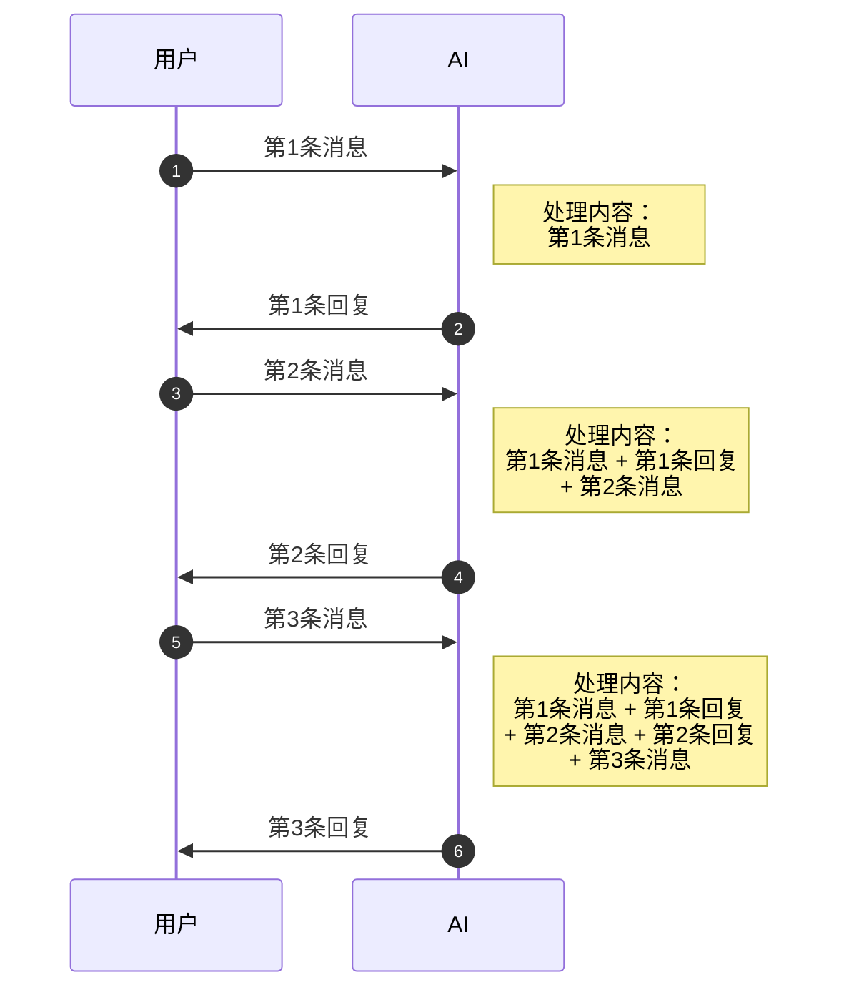
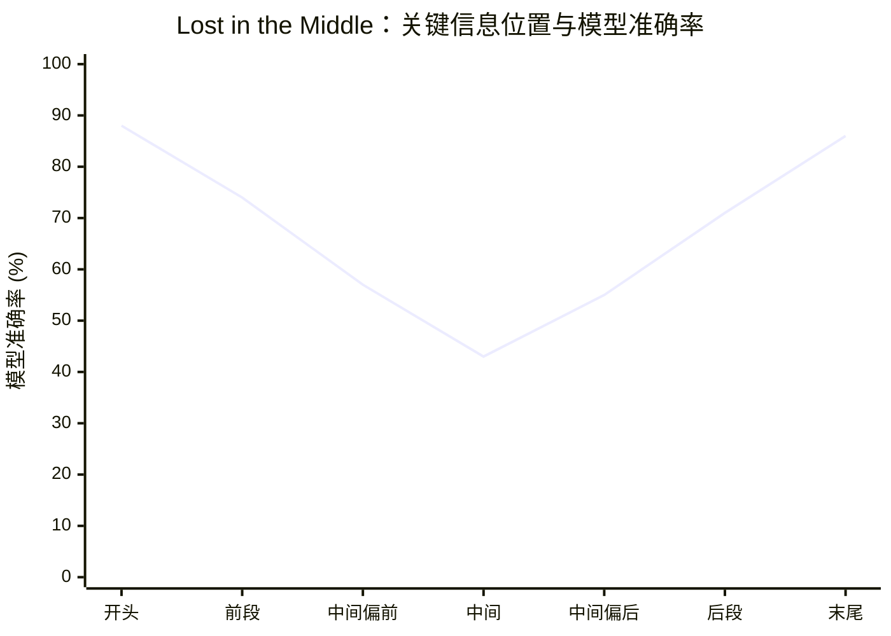

# 上下文窗口是什么

## 本章要点

在上一节，我们了解了预训练和微调如何把 AI 从一个只会续写文本的程序，塑造成一个善于对话的助手。但你在实际使用中可能已经发现，这个助手有时候会"失忆"——聊着聊着，AI 似乎忘记了之前说过的话。这背后的原因，与一个叫做"上下文窗口"的概念密切相关。

现在，让我们兑现这个承诺。

上下文窗口可能是你在使用 AI 时最值得深入理解的一个概念。它直接决定了 AI 在一次对话中能"看到"多少信息，决定了它什么时候会开始"遗忘"，也深刻影响着你与 AI 协作的方式和最终效果。无论你是用 AI 写代码、聊天，还是分析文档，上下文窗口都在背后默默影响着你的每一次体验。

读完这一章，你会获得：

- 理解上下文窗口的本质：它到底是什么，为什么存在
- 了解主流模型的上下文窗口大小，以及这些数字对你意味着什么
- 认识上下文窗口对日常使用的真实影响——包括一些你可能没有意识到的坑
- 掌握有效管理上下文的实用策略，让 AI 更好地为你工作
- 理解"迷失在中间"这个反直觉的重要现象，避免踩坑

## 你是否遇到过这些情况？

在正式介绍上下文窗口之前，让我先描述几个你可能经历过的场景。

**场景一：AI 突然"失忆"了。** 你在一次很长的对话开头，详细交代了项目背景：使用 React 18 和 TypeScript，代码规范遵循 Airbnb 风格指南，所有组件必须有单元测试。随后你们进行了几十轮讨论。然而到了对话后期，你让 AI 帮你再写一个新组件，它却用 JavaScript 写了，完全没有 TypeScript，也没有测试——仿佛从未听说过你那些要求。

**场景二：你把整个代码文件粘贴给 AI，但它只处理了一半。** 你有一个 2000 行的代码文件，想让 AI 做全面审查。你把全文贴进去，但 AI 的反馈只涵盖了文件前半部分，后半部分仿佛不存在。

**场景三：一模一样的问题，回答质量却判若云泥。** 在一段新开始的对话里问 AI 某个技术问题，它给出了精彩细致的回答。但在一段已经进行了很久的对话末尾，问同样的问题，回答却变得模糊、有时甚至出错。

这三个场景背后，都指向同一个原因：**上下文窗口的限制**。

## 上下文窗口：AI 的"工作台"

### 一个帮你理解的比喻

想象你坐在一张书桌前工作。书桌的大小是有限的，桌面上只能同时摊开一定数量的文件和资料。你处理任务时，会把相关资料一一铺开，边看边工作。

但如果文件越摆越多，桌面放不下了怎么办？你只能把最早放上来的文件收进抽屉，腾出空间给新资料。那些被收走的文件，你暂时就看不到了。如果后续工作需要参考那些被收走的内容，你可能就会做出不够准确的判断，甚至在不知情的情况下犯错——因为你根本不记得那些内容曾经摆在桌上。

大语言模型的"上下文窗口"就是这张书桌。它定义了 AI 在回答你的问题时，能够同时"看到"的信息总量。所有摆在这张桌上的内容，AI 都能参考；而一旦被"收走"的内容，AI 就真的看不见了。

### 技术上是怎么回事？

从技术层面来说，上下文窗口（Context Window）是大语言模型在一次推理过程中能够接收和处理的最大文本长度。这个长度用"Token"来衡量——你可以先把 Token 理解为 AI 处理文本的基本单位，大致相当于一个中文字或半个英文单词（下一章会详细介绍 Token）。

当你和 AI 进行多轮对话时，实际发生的事情是这样的：



注意这个关键点：**每一轮对话，整个历史记录都会被重新打包发送给 AI。** 大语言模型本身并没有持久记忆——它不会真的"记住"之前说过什么。每次生成回复时，它都是从头阅读整个对话历史，基于这些内容来做出回应。

这就意味着，随着对话推进，需要发送给 AI 的文本会越来越长。当总长度超过上下文窗口的限制时，最早的内容不得不被丢弃。一旦被丢弃，AI 就真的"看不到"那部分信息了——在它的视角里，那些内容压根儿不存在。

这就是 AI "失忆"的真相：不是它遗忘了什么，而是那些信息根本就不在它的"书桌"上了。

### 上下文窗口里装了什么？

很多人以为上下文窗口只包含用户的消息，但实际情况远不止于此。以下内容都会占用上下文窗口的空间：

**系统提示词（System Prompt）**，也叫"系统指令"，是产品或开发者预先设置的指令，告诉 AI 它的角色、行为规范和任务背景——比如"你是一个专业的 Python 助手，请用简洁的中文回答"。你在使用 ChatGPT、Claude 这类产品时通常看不到它，但它始终占据着上下文的一席之地，而且通常在最前面。

**用户消息**，即你发给 AI 的所有内容——你的问题、你粘贴的代码、你提供的背景信息、你上传的文档。

**AI 的回复**，也就是 AI 生成的所有回答。这一点很容易被忽略：AI 自己的输出同样会计入上下文。当 AI 给出一个详细的长篇解答时，它不仅给了你信息，同时也"用掉"了大量的上下文空间。

**工具调用记录**，在 AI Agent 等场景下，AI 可能会调用外部工具（比如搜索引擎、代码执行器），这些调用的指令和返回结果也都会写入上下文窗口。

所有这些内容加在一起，构成了当前对话的"总上下文"。当总量接近或超过窗口限制时，最早的内容就会被截断或压缩。

## 各大模型的上下文窗口有多大？

理解了上下文窗口的概念，你可能想知道：现在的模型到底能处理多少内容？

截至 2025 年底，主流大语言模型的上下文窗口大小差异显著。下面是一个大致的对比：

| 模型 | 上下文窗口 | 大约相当于 |
|------|-----------|-----------|
| GPT-4o | 128K Token | 约 10 万字中文，一本中等篇幅的小说 |
| GPT-5 | 400K Token | 约 30 万字中文，三四本普通书籍 |
| Claude Sonnet 4 | 200K Token | 约 15 万字中文，两三本小说 |
| Claude Sonnet 4（扩展模式） | 1M Token | 约 75 万字中文，一整套系列丛书 |
| Gemini 2.5 Pro | 1M Token | 约 75 万字中文 |
| Llama 4 Scout | 10M Token | 约 750 万字中文，理论上能装下一座小型图书馆 |

这些数字看起来很惊人。1M Token 大约能装下整本《红楼梦》加上《三国演义》还绰绰有余。10M Token 更是达到了令人难以想象的规模。

但我必须泼一盆冷水：**这些数字并不等于"能有效处理"的内容量。**

### 大不等于好

这是上下文窗口最重要、也最容易被误解的一点。

很多人看到 1M Token 的上下文窗口，会以为"太好了，以后把整个项目代码都扔进去就行了"。但实际上，超大上下文窗口在工程实践中面临着一个非常现实的问题——我们稍后会专门讨论它，它有个生动的名字叫做"迷失在中间"（Lost in the Middle）。

此外，更大的上下文意味着：
- **更慢的响应速度**：AI 需要处理更多内容，你等待的时间会更长
- **更高的使用成本**：如果你通过 API 使用 AI，每一个 Token 都需要付费，长上下文意味着更高的账单
- **更不稳定的质量**：在极长的上下文下，模型的注意力更加分散，回答质量往往不如短上下文时稳定

### 输出长度也有独立限制

有一点经常被忽视：除了输入的上下文窗口，AI 单次回复的长度也有独立上限，这叫做"最大输出长度"（Max Output Tokens）。

以 2025 年底为例，Claude Sonnet 4 的最大输出约为 128K Token，而 GPT-4o 约为 16K Token。这意味着即使你的上下文还有大量剩余空间，AI 在一次回复中能生成的内容也是有限的。

这就是为什么当你让 AI "帮我写一个完整的应用程序"时，它通常会分模块、分步骤来生成，而不是一次性交出所有代码。这不是 AI 在偷懒，而是它的单次输出确实有长度限制。

## 为什么上下文窗口存在限制？

你可能会想：既然上下文越大越灵活，为什么不把它做成无限大？

这背后有深刻的技术原因，理解它能帮你更好地感受到限制的"必然性"，而不是把它当作设计缺陷。

还记得上一章介绍的 Transformer 架构吗？它的核心是"自注意力"机制——让文本中每一个 Token 都能与其他所有 Token 进行"交流"，从而理解上下文关系。这种机制赋予了大模型强大的理解能力，但它带来了一个严峻的代价。

### 平方级增长：计算量的噩梦

在自注意力机制中，每增加一个 Token，它就需要与已有的所有 Token 各进行一次计算。这意味着计算量随 Token 数量的增长呈**平方级增长**。

用具体数字感受一下：

- 1,000 个 Token → 约 100 万次计算
- 10,000 个 Token → 约 1 亿次计算（增加了 100 倍）
- 100,000 个 Token → 约 100 亿次计算（又增加了 100 倍）

Token 数量增加 10 倍，计算量却增加 100 倍。这种增长速度是极其陡峭的，直接体现在你感受到的响应速度和背后的计算成本上。

### 内存的物理限制

除了计算量，内存也是硬约束。自注意力机制需要在 GPU 内存中维护一个巨大的"注意力矩阵"，其大小同样是 Token 数量的平方。当上下文达到几十万甚至上百万 Token 时，所需的内存量是惊人的，这直接限制了单次可处理的文本长度。

这也是为什么在 API 定价中，很多服务商对超过一定长度的上下文请求会收取更高的费用——处理长上下文确实消耗了更多昂贵的硬件资源。

### 技术在突破，但限制仍然存在

好消息是，研究人员一直在努力突破这个限制。FlashAttention 等算法通过优化内存访问方式，大幅降低了处理长上下文的内存消耗和计算时间。Ring Attention 技术让多块 GPU 协同处理超长上下文成为可能。2025 年 Meta 发布的 Llama 4 Scout，通过 iRoPE 创新架构实现了 10M Token 的上下文窗口——这在几年前是不可想象的。

但即便有这些突破，物理规律和经济成本仍然是客观存在的约束。上下文窗口会继续增长，但"无限上下文"在可预见的未来仍然是遥远的目标。

## 上下文窗口如何影响你的日常使用

理解了原理，让我们回到最实际的问题：它具体是怎样影响你用 AI 的体验的？

### 长对话中的"遗忘"

这是最直观的影响。当对话进行了很多轮，早期的消息可能已经被截断或压缩，AI 真的"看不到"那些内容了。

一个典型的场景：你在对话开头告诉 AI"我们的项目使用 Python 3.11，禁止使用第三方库"。经过二三十轮关于不同功能的讨论后，你让 AI 帮你写一个新函数，它可能会毫不犹豫地 `import requests`——因为那条"禁止第三方库"的指令，早就不在它的"书桌"上了。

不同的 AI 产品处理这个问题的策略不同。有些会在对话接近上限时自动对早期内容进行摘要压缩，保留关键信息，丢弃细节；有些会直接截断。无论哪种方式，信息的损失是不可避免的，而且最麻烦的地方在于：**AI 不会告诉你它已经"忘记"了什么**。它会继续自信地回答，好像什么都没发生一样。

### 大文件处理的困境

当你想让 AI 处理一个大型文件时，上下文窗口的限制就格外明显。

想象你有一份 3000 行的代码文件，想让 AI 做全面审查。即使模型的上下文窗口理论上能装下整个文件，你也要注意：这个文件可能占据了上下文的大部分空间，留给 AI 生成回复的空间所剩无几，导致分析只能蜻蜓点水。而且，关于上下文不同位置的处理质量问题，我们很快就会讲到——这个问题会让你对"把整个文件塞进去"的做法重新思考。

### 代码项目中的挑战

对于正在学习用 AI 辅助编程的你，上下文窗口的限制在代码项目中的影响尤为值得关注。

一个真实的软件项目，代码散布在几十甚至几百个文件里。没有任何一个模型的上下文窗口能够容纳整个项目的所有代码。这意味着当 AI 帮你修改某个文件时，它通常看不到其他文件的内容——不知道某个函数在别处是如何被调用的，不知道某个接口的完整定义，也不知道整个项目的架构全貌。

这就是为什么现代 AI 编码工具（比如第二章介绍的 Cursor 和 Claude Code）会花大量精力在"上下文管理"上。它们不是简单地把所有代码塞进去，而是通过智能分析，找出与当前任务最相关的代码片段放入上下文，忽略不相关的部分。这种精挑细选，往往比"一股脑全塞进去"效果更好。

理解这一点，你就会明白：当你使用 AI 编程工具时，**给 AI 提供精准的上下文，远比提供大量的上下文更有价值**。

### 对使用成本的影响

如果你通过 API 自己开发 AI 应用，上下文窗口的大小与你的钱包直接挂钩。大多数 AI 服务商按 Token 数量计费——每次调用时，发送和接收的每一个 Token 都要收费。

以 2025 年底 Claude Sonnet 4 的 API 价格为例，输入约为每百万 Token 3 美元，输出约为每百万 Token 15 美元。这听起来很便宜，但算一算就知道了：如果一段长对话积累了 100K Token 的历史，每发一条新消息，这 100K Token 的历史就要重新发送一次——相当于每次交互都在付费处理大量历史记录。

即使是普通用户，虽然通常不直接感受成本，了解这个机制也有助于理解：为什么某些 AI 产品会在长对话后提示你"开始新对话"，以及为什么要合理规划对话的长度。

## "迷失在中间"：一个你必须知道的现象

如果这一章你只能记住一件事，我希望是这一节的内容。

2023 年，斯坦福大学和加州大学伯克利分校的研究者发表了一篇影响深远的论文，题目非常直白：《Lost in the Middle》——**迷失在中间**。论文揭示了一个令人意外的现象：大语言模型对上下文中不同位置的信息，关注程度并不均等。

### 什么是"迷失在中间"？

研究者设计了一系列实验：把一段关键信息放在上下文的不同位置，测试模型能否准确找到并使用这些信息。

结果出人意料：当关键信息放在上下文的**开头**或**末尾**时，模型表现很好；但当关键信息放在上下文的**中间**时，模型的表现会显著下降。

这种表现构成了一个清晰的 U 形曲线：



这意味着什么？

想象你正在让 AI 分析一份 40 页的技术文档。你关心的那个关键信息恰好在第 20 页——正中间的位置。即使这份文档完全在模型的上下文窗口之内，AI 找到并准确使用这个信息的能力，也会明显低于它在第 1 页或最后一页时的表现。

更重要的是：2025 年的后续研究进一步证实，这个问题并没有随着上下文窗口变大而消失。模型的窗口从 128K 扩展到 1M，U 形曲线依然存在——只不过"中间"的范围更大了，意味着更多的内容会落在这个"关注低谷"里。**更大的窗口不能解决这个问题，反而创造了更大的"中间地带"。**

### 为什么会这样？

2025 年 MIT 的研究揭示了这个现象的技术根源：这与 Transformer 架构中"因果注意力掩码"的工作方式有关。

简单理解：在生成回答时，模型只能看到当前位置之前的内容。随着层层计算推进，上下文开头的 Token 被后续所有 Token 反复"引用"和"加工"，它们的信息被深深编码进了模型的内部表示中，自然获得了很高的"关注度"。而中间部分的 Token，既没有开头那样被反复引用的优势，也没有末尾那样"离输出最近"的优势，就像被夹在人群中的声音，最容易被淹没。

这不是某个模型的 bug，而是当前主流架构的系统性特征。

### 这对你的实际使用意味着什么？

"迷失在中间"这个现象，对我们使用 AI 有几条非常具体的启示：

**不要盲目追求把所有信息都塞进上下文。** 更多的信息不一定更好。如果关键信息被淹没在一大段与任务无关的内容中间，AI 可能根本无法有效利用它。

**把最重要的信息放在最前面或最后面。** 这是一条简单但有效的原则。如果你要给 AI 一段代码和一个需求描述，把需求描述放在代码之前（让 AI 带着目标去阅读代码），或者在文末再次重申关键要求（让关键指令处于高关注度的末尾位置），效果通常会更好。

**长对话不一定优于短对话。** 随着对话越来越长，早期的消息和回复会堆积在上下文的"中间地带"，被有效关注的概率下降。有时候，结束当前对话、开启新会话，把精华信息重新整理后放在开头，反而能得到更高质量的回答。

**对 AI 处理超长文档的能力保持理性预期。** 即使模型支持 1M Token 的上下文，也不意味着它能同样出色地处理文档每个角落的内容。如果你需要从一份长文档中提取关键信息，比随机放入更好的策略是：先让 AI 分段处理，再汇总。

## 有效管理上下文的实用策略

了解了这些限制，最实际的问题来了：有什么办法能让我们更好地利用有限的上下文空间？

### 策略一：适时开始新对话

这是最简单也最有效的策略，但很多人因为"舍不得"之前的对话历史而迟迟不做。

当你感觉对话已经很长，AI 的回答质量开始下降时，果断开启一个新会话。在新会话的开头，把之前讨论中最重要的结论和关键背景重新整理，简洁地提供给 AI。这就等于给了 AI 一张全新的、整洁的"书桌"，上面只摆着最重要的资料。

事实上，这样做通常比继续在一个塞满内容的旧对话中挣扎效果更好——因为你对旧对话的重要信息往往有更清醒的认识，整理出来的上下文反而比散乱的历史记录更有价值。

### 策略二：精心组织输入的顺序

既然我们知道开头和末尾的位置拥有最高的"关注度"，就应该有意识地安排输入结构。

一个实用的模式是：**任务说明 → 参考材料 → 明确指令**。

把整体任务目标放在最前面，让 AI 首先理解它要做什么。然后提供参考材料（代码、文档、数据）。最后，在末尾明确重申你的具体要求或问题。这样，核心需求分别占据了开头和末尾这两个"黄金位置"。

对比两种写法：

```
❌ 容易被"迷失"的写法：
这是第一段代码：[代码片段A]
我想用 TypeScript 重构代码，保持向后兼容。
这是第二段代码：[代码片段B]
注意要添加完整的类型注解。

✅ 更好的写法：
任务：用 TypeScript 重构以下代码，保持向后兼容，并添加完整类型注解。

参考代码：
[代码片段A]
[代码片段B]

请按照上述要求完成重构。
```

第二种写法把核心需求放在了开头，明确指令放在了末尾，参考材料夹在中间。即使 AI 对中间部分的关注度有所下降，你的核心需求也不会被遗漏。

### 策略三：分而治之

面对复杂的大任务，与其一次性把所有信息和要求都塞给 AI，不如把任务分解成几个小步骤，分别进行交互。

比如你想让 AI 重构一个复杂的模块，可以这样做：

1. 第一轮：让 AI 分析现有代码，给出重构方案
2. 第二轮：基于方案，处理第一个功能模块
3. 第三轮：处理第二个功能模块
4. ……

每一轮对话都聚焦在一个具体的小任务上，上下文干净精准。这比把所有代码和所有需求一股脑塞进一个超长对话里，效果往往要好得多。

### 策略四：提供必要的上下文，而非全部的上下文

这条策略的核心思想是：**给 AI 它需要的信息，而不是你拥有的所有信息。**

当你让 AI 帮你修复一个 bug 时，你不需要把整个项目的代码都粘贴进去。通常只需要：

- 出现问题的代码片段
- 完整的错误信息
- 这段代码直接依赖的接口或类型定义
- 一两句背景说明

这就够了。多余的信息不仅浪费上下文空间，还可能干扰 AI 的判断——它可能花了大量"注意力"在那些无关的代码上，反而忽略了真正重要的部分。

### 策略五：把关键指令放在持久的位置

如果你使用的 AI 工具支持"系统提示词"或"自定义指令"（比如 ChatGPT 的 Custom Instructions、Claude 的 Project Instructions），充分利用这个功能。

系统提示词位于上下文的最前面，拥有最高的关注度，而且不会随着对话的推进被截断。把那些你希望 AI 始终记住的核心要求放在这里——比如"生成的所有代码必须包含错误处理"、"回复时请使用中文"、"我们的项目使用 Node.js 20 和 TypeScript 5"——比在每次对话中重复说要稳定得多。

## 上下文窗口与 Token 的关系

在这一章中，我们反复提到"Token"这个词——上下文窗口的大小是用 Token 来衡量的。你可能已经对 Token 有了一个模糊的印象，但 Token 其实比你想象的更有趣，也更复杂。

同样一句话，中文和英文消耗的 Token 数量不同；普通文字和代码消耗的 Token 数量不同；甚至同一段代码，写法不同消耗的 Token 数量也不同。理解 Token 的计算方式，能帮你更准确地估算上下文窗口的实际可用空间，在实际使用中做出更聪明的选择。

这正是下一章的主题：**Token——AI 的"词汇单位"**。

## 从 4K 到 10M：一段飞速演进的历史

在结束这一章之前，让我们简单回顾一下上下文窗口的发展历程，你可能会为这种进步速度感到震惊。

2022 年底，ChatGPT 刚刚发布时，底层的 GPT-3.5 模型只有约 4K Token 的上下文窗口——大约相当于 3000 个中文字。对话聊几轮，早期内容就会开始被截断。

2023 年，GPT-4 将窗口提升到 8K，并推出了 32K 的扩展版本。同年，Claude 2 突破性地达到了 100K Token，在当时遥遥领先。

2024 年，上下文窗口进入"百K时代"：GPT-4o 达到 128K，Claude 3 达到 200K，而 Google 的 Gemini 1.5 Pro 更是直接支持了 1M Token。

2025 年，扩展继续：Claude Sonnet 4 支持了 1M Token 的扩展模式，GPT-5 达到 400K，Meta 的 Llama 4 Scout 更是创下了 10M Token 的纪录。

短短三年，从 4K 到 10M——增长了整整 2500 倍。

但技术的突飞猛进并不能掩盖一个基本事实：**有效利用上下文，始终比单纯增大上下文更加重要。** 给 AI 最精准的信息，往往比给它最多的信息更加有效。掌握这一点，你对 AI 的使用就已经超越了大多数普通用户。

## 小结

这一章，我们从使用者的视角深入探讨了上下文窗口这个重要概念。

**上下文窗口**是大语言模型在一次推理过程中能处理的最大文本长度，就像 AI 的"工作台"——所有的对话历史、系统指令、你的输入和 AI 的输出，都在这张桌上。桌满了，最早的内容就会被移走。

**大语言模型没有持久记忆。** 每一轮对话，整个历史都会重新发送给模型。当历史超过上下文窗口的限制时，早期内容会被截断或压缩——这就是 AI "失忆"的真正原因。

**更大的上下文不等于更好的结果。** 研究表明，模型对处于上下文中间位置的信息关注度明显较低，这就是"迷失在中间"现象。超大上下文窗口创造了更大的"中间地带"，问题并不会自动消失。

**上下文窗口有限的根本原因**在于 Transformer 架构中自注意力机制的平方级计算复杂度——Token 数量翻倍，计算量翻四倍。这直接影响了响应速度和使用成本。

在实践中，我们可以通过**适时开启新会话**、**精心安排输入结构**、**分解大任务**、**提供精准而非海量的上下文**等策略，有效地应对上下文窗口的限制。

记住这句话：给 AI 一张整洁的、只摆着关键资料的书桌，远比给它一张堆满了各种文件的凌乱书桌更有价值。

## 练习

### 思考题 1：消耗速度的计算

假设你正在使用一个上下文窗口为 200K Token 的模型。初始系统提示词占 2K Token，你在对话开头粘贴了一段 20K Token 的代码，然后进行了 20 轮对话——每轮你的消息平均 500 Token，AI 的回复平均 3000 Token。

- 请估算这 20 轮对话结束时，上下文的总 Token 数量是多少
- 这占上下文窗口的多大比例？
- 如果继续下去，大约还能进行几轮对话就会触及上限？

### 实践题 2：亲身体验"迷失在中间"

尝试做这个小实验：

1. 准备三个不同的数字（比如 42、781、1337）
2. 创建一段较长的文本，把这三个数字分别藏在文本的**开头**、**中间**和**末尾**
3. 把整段文字发给 AI，然后问："文章中提到了哪些具体数字？"
4. 记录 AI 的回答，看看哪个数字最容易被遗漏

重复几次，把数字的位置对调，观察结果的变化。这个实验能让你直观地感受到不同位置对 AI 关注度的影响。

### 实践题 3：对比两种上下文策略

选一个你最近遇到的实际编程问题，分别用两种方式请教 AI：

**方式 A**：在已经进行了很多轮讨论的旧对话中，继续追问这个问题

**方式 B**：开启一个全新的对话，在开头清晰、简洁地提供问题背景和关键信息

认真比较两次回答的质量：哪次更准确？哪次更详细？哪次更切中要害？思考为什么。

### 思考题 4：为你的场景设计上下文策略

假设你正在使用 AI 来完成以下任务，分别思考你会如何管理上下文：

1. **调试一个复杂 bug**：你需要提供哪些信息？哪些信息是不必要的？
2. **重构一个 500 行的函数**：一次性处理，还是分步处理？如何分步？
3. **学习一个新技术框架**：如何设计一系列对话，在不超出上下文的情况下系统学习？

说出你的策略，以及背后的理由。

### 讨论题 5：上下文窗口的未来

上下文窗口从 2022 年的 4K 增长到了 2025 年的 10M，增长了 2500 倍。你认为：

- 这种增长会继续下去吗？它有没有物理上的极限？
- 如果未来上下文窗口变得足够大，以至于能容纳一个完整的大型代码库，我们的编程方式会发生什么改变？
- "迷失在中间"这个问题，最终会被技术解决，还是会成为一个持久的使用挑战？
