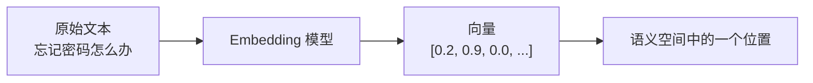
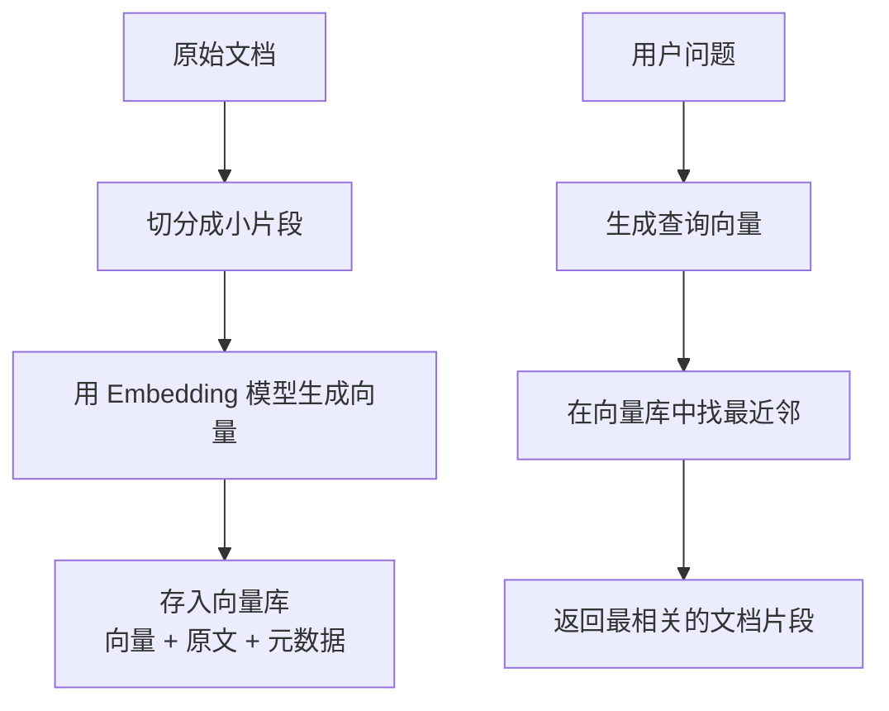

# 向量嵌入与语义理解

## 本章要点

走到第九章，我们要再次潜入 AI 的内部看一看。

在第四章里，我们已经认识了 Token、上下文窗口和大语言模型的基本工作方式。你现在知道，AI 并不是像人一样逐字阅读文字，而是先把文字切成 Token，再在神经网络中做一层又一层的计算。但这里还藏着一个很重要的问题：如果 AI 看到的只是 Token 序列，它为什么能知道"忘记密码"和"无法登录账户"说的是相近的事情？为什么你在 AI 编程工具里搜索"用户鉴权逻辑"，它有时能找到文件名里根本没有"鉴权"两个字的代码？

答案就藏在这一节要讲的概念里：**向量嵌入**，也就是 Embedding。

读完这一章，你会获得：

- 理解向量嵌入的本质：把文本、代码、图片等内容转换成一串数字
- 建立"语义空间"的直觉：为什么意思相近的内容在向量空间里会靠得更近
- 了解语义相似度的计算方式：余弦相似度、点积、欧氏距离到底在比较什么
- 看懂语义搜索的基本流程：从"关键词匹配"走向"按意思查找"
- 为下一节 RAG 打基础：理解 AI 如何从外部知识库里找出相关资料

## 从一次搜索失败说起

想象你正在维护一个项目，用户反馈说："我忘记密码后收不到验证码。"

你想找到相关代码，于是在编辑器里搜索：

```text
忘记密码
```

结果什么都没搜到。

你换成：

```text
重置密码
```

还是没有。

最后你翻了半天，才发现代码里对应的函数叫：

```ts
sendRecoveryCode()
```

页面文案叫：

```text
Account recovery
```

数据库字段叫：

```text
password_reset_token
```

你看，问题来了：**人类很容易知道"忘记密码""重置密码""账户恢复""password reset"说的是一类事情，但传统关键词搜索不知道。**

关键词搜索很诚实，也很笨。它只会问一个问题："这几个字有没有出现？"如果没有出现，它就认为不相关。它不理解同义词，不理解翻译，不理解代码命名背后的业务含义，更不理解你真正想找的东西是什么。

但 AI 编码工具、智能知识库、现代搜索系统正在做另一件事：它们不只是匹配字面词语，而是尝试匹配**语义**。也就是说，它们想回答的问题变成了：

> 这段内容和用户的问题，在意思上像不像？

为了做到这一点，AI 需要一种特殊的方法，把"意思"变成计算机可以比较的东西。这就是向量嵌入。

## 把"意思"放进坐标系

### 一个地图的比喻

让我们先不要急着看数学。想象你面前有一张很大的地图，地图上不是城市，而是句子。

在这张地图上：

- "我想重置密码"和"忘记密码怎么办"会被放得很近
- "用户登录失败"和"账号无法进入系统"也会靠得比较近
- "数据库连接超时"会离它们远一些
- "今天晚饭吃什么"则会跑到很远的地方

这张地图不是按字面排列的，而是按"意思"排列的。意思越接近，距离越近；意思越无关，距离越远。

向量嵌入做的事情，正是把一段内容放到这样一张"语义地图"上。

在二维地图里，一个位置可以用两个数字表示，比如：

```text
(经度, 纬度)
```

而在 AI 的语义地图里，一个位置通常要用几百个、几千个数字来表示，比如：

```text
[0.012, -0.238, 0.871, ..., -0.045]
```

这串数字，就是一个向量。把文本变成这串向量的过程，就叫做**向量嵌入**。

### 什么是向量？

向量听起来像数学课上的词，但它其实很朴素：**向量就是一组有顺序的数字**。

如果你去电影院看电影，平台可能会用几个数字描述你的偏好：

```text
[动作片偏好, 喜剧片偏好, 科幻片偏好, 爱情片偏好]
```

假设小鹿同学的电影偏好是：

```text
[0.8, 0.3, 0.9, 0.2]
```

这大概表示：她很喜欢动作片和科幻片，对喜剧片一般，对爱情片兴趣不高。

另一个人的偏好可能是：

```text
[0.1, 0.9, 0.2, 0.8]
```

这表示他更喜欢喜剧片和爱情片。

你看，只要把偏好变成数字，我们就可以比较两个人是不是相似。向量嵌入也是类似的思路，只不过它描述的不是电影偏好，而是一段文本、代码或图片在语义空间里的位置。

### 一个极简的例子

为了方便理解，我们先假设有一个非常简化的 3 维语义空间：

| 内容 | 技术相关 | 账号相关 | 饮食相关 |
|------|----------|----------|----------|
| "忘记密码怎么办" | 0.2 | 0.9 | 0.0 |
| "如何重置登录密码" | 0.3 | 0.95 | 0.0 |
| "数据库连接失败" | 0.9 | 0.1 | 0.0 |
| "今天吃什么" | 0.0 | 0.0 | 0.95 |

这张表当然是虚构的，真实的 embedding 维度不会这么直观，也不会把某一维明确命名为"账号相关"。但它能帮你建立第一层直觉：**向量的每个数字，携带了内容在某个隐含方向上的特征；所有数字合在一起，就构成了这段内容的语义位置。**

用图表示，大致是这样：



当很多文本都被转换成向量之后，我们就不再只能比较"字面是否一样"，而是可以比较"位置是否接近"。

## Embedding 模型在学什么？

### 不是人工设计坐标轴

看到这里，你可能会问：这些数字是谁定的？是不是工程师手动设计了很多维度，比如"账号相关""技术相关""情绪积极""代码复杂度"？

不是。

真实的 embedding 模型不是靠人工给每个维度起名字，而是从大量数据中自己学出来的。它在训练时会见到海量文本、代码、问答、翻译、搜索点击记录等数据，从中慢慢学会：哪些表达经常指向同一个意思，哪些句子应该靠近，哪些内容应该分开。

比如，它会在数据里反复看到这些关系：

```text
"forgot password" ≈ "reset password"
"用户登录失败" ≈ "无法进入账号"
"array sort in JavaScript" ≈ "JS 数组排序"
```

久而久之，模型就学会把这些内容放到相近的位置。

这和我们第四章讲过的"AI 从数据中学习模式"是一脉相承的。区别在于，大语言模型常常被用来生成下一个 Token，而 embedding 模型更像是在做另一件事：**为输入内容生成一个稳定的语义坐标**。

### "理解"是一种有用的近似说法

我们常说 AI "理解"了语义，但这里的"理解"需要打上引号。

人类理解一句话，会联系生活经验、情绪、常识和真实世界。比如你说"我今天累坏了"，朋友可能听出你需要休息，也可能听出你在委婉拒绝晚上的聚会。

Embedding 模型的理解方式要窄得多。它并没有真实体验过"累"，也没有你的生活背景。它做的是：根据训练中见过的大量语言模式，把这句话放到一个合适的向量位置上，让它靠近"疲惫""需要休息""状态不好"之类的表达，远离"天气预报""数据库索引"之类的内容。

所以，更准确地说：

> 向量嵌入不是把人类意义完整装进数字里，而是把"可计算的语义相似性"编码进数字里。

这个能力已经足够强大。搜索、推荐、聚类、去重、代码检索、RAG，很多今天看起来很聪明的 AI 应用，底层都离不开它。

## 语义相似度：AI 怎么判断"像不像"

当两段文本都变成向量后，下一个问题就是：怎么判断它们是否相似？

最常见的做法，是计算它们在向量空间中的距离或夹角。你可以把每个向量想象成从原点伸出去的一支箭头。两支箭头指向越接近，说明它们语义越相似；指向差得越远，说明它们语义差异越大。

### 余弦相似度：比较方向，而不是长度

在文本 embedding 中，最常见的相似度指标之一叫**余弦相似度**（Cosine Similarity）。

公式长这样：

```text
cosine(A, B) = A · B / (|A| × |B|)
```

如果你不喜欢公式，可以只记住它的直觉：**余弦相似度比较的是两个向量的方向是否一致。**

- 如果两个向量方向几乎一样，相似度接近 1
- 如果两个向量关系不大，相似度接近 0
- 如果两个向量方向相反，相似度可能接近 -1

在实际语义搜索中，我们通常会把相似度最高的几个结果取出来。比如用户搜索：

```text
如何重置登录密码？
```

系统可能得到这样的结果：

| 候选内容 | 相似度 |
|----------|--------|
| "忘记密码后，可以通过邮箱验证码重置密码。" | 0.91 |
| "账号无法登录时，请检查密码或联系客服。" | 0.78 |
| "修改头像需要进入个人资料页面。" | 0.34 |
| "数据库连接失败通常与网络或配置有关。" | 0.18 |

前两条虽然不一定包含"重置登录密码"这几个字，但它们在意思上很接近，所以会被排在前面。

这就是语义搜索和关键词搜索最根本的区别。

### 点积、欧氏距离和"最近邻"

除了余弦相似度，你还会在文档里看到另外几个词：点积、欧氏距离、最近邻搜索。

**点积**可以理解为另一种衡量两个向量是否同向的方法。很多 embedding 模型输出的向量会被归一化，也就是长度被调整为 1。在这种情况下，点积和余弦相似度的效果非常接近。

**欧氏距离**则更像地图上的直线距离。两个点离得越近，距离越小，语义越相似。

**最近邻搜索**说的是：给定一个查询向量，在一大堆向量里找出离它最近的几个。这里的"邻居"不是人，而是向量空间中的邻居。

如果你的知识库只有 100 篇文章，直接逐个比较也没问题。但如果你有 100 万段文档、1000 万段代码片段，就不能每次都傻傻地全部算一遍了。于是，工程上会用专门的向量索引或向量数据库来加速搜索。像 Faiss 这样的相似度搜索库，或者 pgvector 这样的 PostgreSQL 扩展，做的就是这类事情：让系统能在大量向量中快速找到最接近的结果。

## 从关键词搜索到语义搜索

现在，我们可以把整个流程串起来了。

假设你要做一个"项目文档智能搜索"功能，让用户用自然语言搜索公司内部文档。传统搜索可能会直接建立关键词索引，而语义搜索会多走一步：先把文档变成向量。



这里有几个细节很关键。

首先，文档通常不会整篇直接做 embedding。因为一篇长文档里可能同时讲很多主题，如果把它压成一个向量，很多细节会被混在一起。更常见的做法是把文档切成较小的片段，比如按标题、段落或固定长度切分。这样每个向量代表一个相对清晰的小主题。

其次，向量库里不能只存向量。向量只是用来搜索的坐标，真正要展示给用户、交给 AI 阅读的，仍然是原文片段。所以一个完整的记录通常包括：

- 向量：用于相似度搜索
- 原文：用于展示或交给大模型作为参考
- 元数据：比如文件名、章节标题、创建时间、权限范围

最后，用户的问题也要变成向量。系统会用同一个或配套的 embedding 模型，把用户问题转换成查询向量，再去向量库里找相似内容。

这就是语义搜索的基本骨架。

## 为什么这对 AI 编程很重要？

你可能会想：向量搜索听起来像搜索引擎的事情，和 AI 编程有什么关系？

关系非常大。

现代 AI 编程工具之所以能在一个项目里"找上下文"，背后就离不开类似的思想。一个真实项目里有很多文件，AI 不可能每次都把整个仓库塞进上下文窗口。它必须先判断：当前任务最相关的文件、函数、注释、测试用例在哪里？

这时，语义检索就派上用场了。

当你对 AI 说：

```text
帮我看看用户登录后为什么跳转失败
```

工具可能会去找：

- 路由守卫相关代码
- 登录接口调用代码
- token 存储逻辑
- 页面跳转函数
- 相关测试用例

这些文件里未必都写着"跳转失败"四个字。它们之所以能被找出来，是因为工具在某种程度上理解了你的问题和代码之间的语义关系。

同样，embedding 也可以帮助你做很多开发相关的事情：

**代码搜索**：用自然语言搜索代码，比如"负责校验用户权限的地方在哪里？"

**相似代码检测**：找出项目里功能相近、可能重复实现的函数。

**文档问答**：把项目文档、README、接口说明做成知识库，让 AI 根据真实文档回答问题。

**错误排查**：把历史故障、日志、解决方案向量化，遇到新错误时找相似案例。

**需求归类**：把用户反馈或 issue 聚类，发现大家集中抱怨的问题。

这些能力看起来很不一样，但底层都在做同一件事：把内容放进语义空间，再寻找相近的内容。

## Embedding 与 RAG 的关系

下一节我们会讲 RAG，也就是 Retrieval-Augmented Generation，通常翻译为"检索增强生成"。

RAG 的核心思想很简单：大模型回答问题前，先去外部知识库里检索相关资料，再把这些资料放进上下文，让模型基于资料回答。

而"检索相关资料"这一步，最常见的做法之一就是 embedding。

你可以把 RAG 想象成一个开卷考试系统：


Embedding 在其中扮演的角色，就是帮检索系统找到那几页最该翻开的资料。

如果 embedding 做得不好，RAG 就像翻错了页的开卷考试。模型再聪明，也只能基于错误或无关的资料回答，效果自然不会好。反过来，如果 embedding 能准确找到相关片段，大模型就能站在更可靠的材料上生成答案。

所以这一节不是孤立的概念课。它是后面理解 RAG、Agent 记忆、工具检索、知识库问答的地基。

## 做好 Embedding 的几个实践直觉

这一节不要求你马上亲手搭一个向量数据库，但我希望你先建立几条实践直觉。等你将来真正做 RAG 或知识库时，这些直觉会非常有用。

### 直觉一：切块比你想象得重要

如果文档切得太大，一个片段里混进太多主题，embedding 会变得"含糊"。比如一篇文档前半部分讲用户登录，后半部分讲支付退款，如果整篇只生成一个向量，系统检索"退款失败"时可能很难精确命中。

如果切得太小，又会丢失上下文。比如只把一句"它会在三分钟后过期"单独拿出来，你根本不知道"它"指的是验证码、登录 token，还是订单锁定状态。

好的切块方式通常要尊重文档结构：标题、段落、代码块、函数边界，都比机械地每 500 个字切一刀更可靠。

### 直觉二：相似不等于正确

Embedding 擅长找"意思相近"，但它不能保证内容事实正确。

比如你问：

```text
如何删除用户账号？
```

系统可能找到了"禁用用户账号"的文档，因为两者语义很接近。但删除和禁用在业务上可能是完全不同的操作：一个不可逆，一个可恢复；一个涉及数据清除，一个只是状态变更。

这提醒我们：向量检索返回的是候选资料，不是真理。真正严肃的系统还需要权限控制、规则校验、重排序、人工审核，或者让大模型在回答时明确引用来源。

### 直觉三：模型要和任务匹配

不是所有 embedding 模型都适合同一件事。

有的模型更擅长英文，有的对中文和多语言支持更好；有的适合普通文本，有的对代码、法律、医学等专业领域更友好；有的模型区分"查询"和"文档"两种输入任务，专门优化检索效果；还有一些多模态 embedding 模型，能把文本和图片放进同一个语义空间，用一句话去搜索图片。

所以，当你真正做应用时，不要只看"维度高不高"或"模型新不新"。更可靠的做法是拿自己的真实数据做一小组评测：给出几十个典型问题，看模型能不能把正确片段排在前面。

### 直觉四：向量库需要更新

Embedding 不是一次生成后就永远不用管。

如果你的文档变了，旧向量不会自动知道。你修改了接口说明，删除了过期流程，新增了安全规则，都需要重新生成相关片段的向量，并更新索引。

这和传统数据库很像：数据变了，索引也要跟着维护。只不过这里的索引不是按关键词排序，而是按语义位置组织。

### 直觉五：敏感信息仍然是敏感信息

把文本变成向量，并不意味着隐私风险消失了。

向量虽然不像原文那样可读，但它仍然来自原文，仍然可能泄露某些信息；向量库里通常还会保存原文片段和元数据，这些更需要权限控制。公司内部文档、用户资料、代码密钥、客户合同，都不能因为"只是做 embedding"就随意发送到外部服务。

在真实项目里，选择云端 embedding API、本地开源模型，还是混合方案，往往不仅是技术选择，也是安全和合规选择。

## 常见误区

### 误区一：向量维度越高，效果一定越好

维度更高，确实可能表达更细的语义差异，但它也会带来更高的存储成本、计算成本和索引成本。更重要的是，维度不是唯一决定因素。训练数据、模型架构、任务匹配度、检索策略，都会影响最终效果。

一个适合你业务数据的中等维度模型，可能比一个看起来更"豪华"但不适配任务的模型效果更好。

### 误区二：相似度分数可以跨模型比较

同样是 0.82 的相似度，在不同 embedding 模型、不同归一化方式、不同检索任务下，含义可能完全不同。

所以，不要简单地说"相似度超过 0.8 就一定相关"。阈值需要在自己的数据上调试。更常见的做法是取 Top K，比如先取最相似的 5 条或 10 条，再用重排序模型、规则或大模型进一步判断。

### 误区三：Embedding 可以替代理解和推理

Embedding 很擅长找相关内容，但它不擅长复杂推理。

如果问题是"哪两段文档主题相近"，embedding 很有用；但如果问题是"根据这三份合同判断哪一条条款优先级更高"，光靠向量相似度就不够了。那需要模型阅读文本、比较条件、处理例外情况，甚至需要法律专业知识。

换句话说，embedding 是 AI 系统的"找资料能力"，不是完整的"思考能力"。

## 小结

这一章，我们认识了向量嵌入这个支撑许多 AI 应用的基础概念。

**Embedding 的本质，是把文本、代码、图片等内容转换成一串数字向量。** 这串数字不是给人看的，而是给机器比较的。它让计算机可以用距离、角度、最近邻等方式，判断两段内容在语义上是否接近。

**语义空间是理解 embedding 的关键直觉。** 在这个空间里，意思相近的内容靠得更近，意思无关的内容离得更远。我们平时说 AI "理解语义"，很多时候就是指它能在这种空间里形成有用的相似性结构。

**语义搜索是 embedding 最重要的应用之一。** 它不再只问"关键词有没有出现"，而是问"这段内容和问题在意思上像不像"。这让 AI 编程工具、知识库问答、文档检索、相似代码查找都变得更聪明。

**Embedding 也是 RAG 的地基。** RAG 想让大模型基于外部资料回答问题，首先就要把相关资料找出来。而在海量文档中找出相关片段，正是 embedding 和向量检索擅长的事情。

最后，也请记住它的边界：相似不等于正确，检索不等于推理，向量化也不等于没有隐私风险。真正可靠的 AI 系统，往往不是只靠一个 embedding 模型，而是把检索、重排序、权限控制、上下文组织和大模型生成组合起来。

下一节，我们就会在这个基础上继续往前走，看看 RAG 如何让 AI 借助外部知识，拥有一种近似"翻书查资料"的能力。

## 练习

### 思考题 1：关键词搜索为什么失败？

回想你最近在代码或文档里搜索某个东西的经历。有没有出现过这种情况：你明明知道某段内容存在，但因为搜索词和原文不一样，怎么都搜不到？

试着写下三组表达，它们字面不同，但语义相近。比如：

```text
忘记密码 / 重置密码 / account recovery
```

思考：如果用关键词搜索，它们为什么不容易互相命中？如果用语义搜索，系统应该如何判断它们相关？

### 实践题 2：手工设计一个二维语义地图

选 8 句话，包含几个不同主题，比如登录、支付、数据库、天气。然后在纸上画一个二维坐标系，凭你的直觉把它们摆在不同位置。

不需要追求数学准确，只要思考：

- 哪些句子应该靠近？
- 哪些句子应该远离？
- 有没有句子同时属于两个主题，位置比较尴尬？

这个练习能帮你体会：语义空间不是简单分类，而是一种连续的"远近关系"。

### 实践题 3：观察 AI 编程工具如何找上下文

打开一个你熟悉的项目，向 AI 编程工具提出一个自然语言问题，比如：

```text
用户登录成功后跳转逻辑在哪里？
```

观察它引用或打开了哪些文件。它找到的文件是否都包含"登录""跳转"这些关键词？有没有一些文件虽然字面不匹配，但语义上确实相关？

把你的观察记录下来。你会更直观地看到：现代 AI 工具并不是只靠关键词在工作。

### 讨论题 4：相似和正确之间的距离

思考下面这个问题：

> 如果一个系统总能找到"看起来很相关"的资料，但资料本身已经过期或错误，这个系统会给用户带来什么风险？

进一步想一想：在真实项目里，你会用哪些办法降低这种风险？比如更新时间标记、来源引用、人工审核、权限控制、重新索引等。
